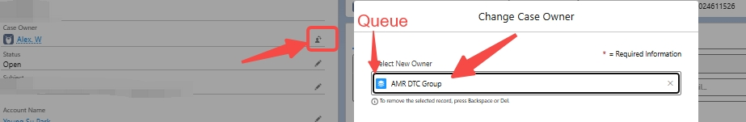
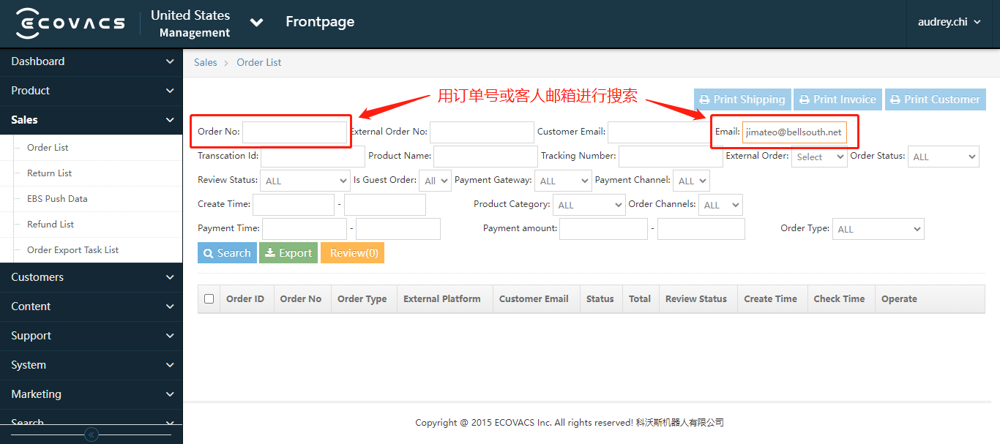
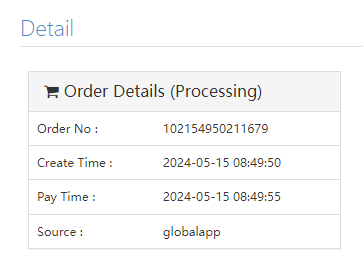
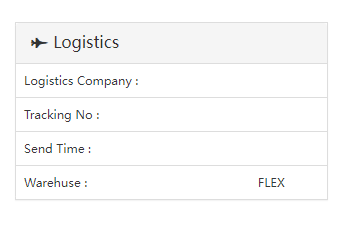

# 一、售前/销售/合作相关流程

### 1\. DTC（Direct\-to\-Customer\) 常用相关政策/内容及提醒

1. 关于官网**订单状态**如何进行确认的问题：

**（1）取消订单/Order Cancellation: **DTC团队会对相关订单进行处理，当对应的订单被正式取消和退款后，用户端可以看到订单状态变为“Cancelled"。

**（2）修改地址/Address Modification：**

- 官网订单处理系统在处理订单前（俗称**推单前**），DTC团队可以在对应的内部系统进行地址的修改，地址修改成功后，用户端**可以看到**地址更改为新地址/正确的地址。

- 如对应的订单**已完成推单**，需要DTC团队进行修改，哪怕是地址修改成功后，用户端也**无法看到**地址被更改为新地址/正确的地址。

*这两类情况从用户提出需求到问题解决都需要一定时间，因此目前没有更直接的方法让一线客服明确查看处理状态。建议将相关问题转交至 DTC 团队进行核实和跟进。如遇紧急情况，可直接联系 DTC 的 Agent Maggie 或 Audrey 以便及时处理。*

2. DTC官网支持30天内退/换货，所有退/换日期都是从包裹寄到用户地址开始计算。如遇到官网**退货**退款的用户，请务必务必努力尝试排障 \- **排障****无法****解决问题，再升级到**** ****AMR DTC Group**

3. 所有在30天内DTC购买的要**退/换**需要直接转给DTC处理，**不要**走售后的质保

4. DTC换机流程提醒：所有走DTC流程的换机都需要用户把**原****机器**寄回来，**送到我们仓库后**DTC才会发新机给用户，请知悉，**千万****不要****和用户说我们会申请优先换机**

### 2\. 促销咨询（Promotion Inquiry）

#### 2\.1 处理流程（Handling Flow）

Currently, the [**maximum discount**](https://lmgx8md8u1.feishu.cn/docx/QgAbdVEWnoKWEkxxRrIcG590nnb#doxcn3kfUoX8Wt6IJLvGq44qgSd)** **available for machine purchases on the official US or Canadian** Ecovacs Official Store** is 5% off, while accessory purchases are eligible for 10% off\. For customers seeking higher discounts or special offers \(such as veterans’ discounts\), please escalate the inquiry to DTC \(Direct\-to\-Customer, Pre\-sales\) for further assistance\.

目前，在**美国或加拿大官方网站**上，**整机购买**可享受的最大优惠券折扣为 **5%**，而**配件购买**可享受 **10%** 折扣。若客户希望获得更高折扣或特殊优惠（例如退伍军人优惠等），请将其咨询升级至 **DTC（Direct\-to\-Customer, 即官网销售团队）** 以获得进一步协助。

**积分使用：**购买机器积分最多可以用**总订单金额的30%**，购买**耗材**最多可以用**10%**

**新注册会员****积分奖励：****美国****新用户奖励****3000积分****；****加拿大：5000**积分

**新注册会员****额外****优惠券奖赏****：赠送**1张**20% 耗材优惠券**，优惠券有效期：**领取后30天内有效**（最终以实际活动规则为基准）**。**

**积分规则详情**：

- **美国**官网积分政策：https://www\.ecovacs\.com/us/ecovacs\-club/ecovacs\-points

- **加拿大**官网积分政策: https://www\.ecovacs\.com/ca/ecovacs\-club/ecovacs\-points

#### 2\.2 最新优惠券（代金券Voucher）代码

Canada \& USA（2026年1月11日后生效）

**购买机器 \(大货\)：CCRB5**

购入机器可用 5% 折扣，可与推广、会员等其他普通折扣优惠码 \(Coupon）叠加使用；不可与售后客服端同类型的代金券叠加 （即 Voucher \+ Coupon 的形式可以，但 CCRB5 \+ CCRB5 不可以\)

**购买耗材：CCACE10**

购入耗材可用 10% 折扣，不与其他券码叠加使用

#### 2\.3 DTC 官网以旧换新 Upgrade Program

[**US Upgrade Program**](https://www.ecovacs.com/us/upgrade)
[**CA Upgrade Program**](https://www.ecovacs.com/ca/upgrade)

如果用户需要了解Upgrade Program的具体规则，可指引如下：

第一步：访问官网 [US Webstore](https://www.ecovacs.com/us) 或 [CA Webstore](https://www.ecovacs.com/ca)

第二步：点击网站上方导航栏的“**Upgrade Program**” 

第三步：在Upgrade Program界面下滑，找到以下截图界面中的“**How it works**"，点击右上角的"**Rules**"便可了解具体规则。

###### **2\.3\.1 了解Upgrade Program相关咨询**

若客户需要了解更多Upgrade Program的相关咨询，请参考以下模板。
**使用模板：** US \& CA Upgrade Program/Loyal Customer Buy New

###### **2\.3\.2 Upgrade Program**** ****两种模式**

**模式一：无需寄回旧机**

客户使用旧机 Serial Number 码在官网兑换 Voucher 进行购买，客户无需寄回旧机。

**模式二：需寄回旧机**

客户使用旧机 Serial Number 码兑换Voucher进行购买后，**需将旧机寄回**，旧机退回后，Voucher兑换的Upgrade Credit才会退还给客户。

**美国官网Trade In以旧换新，于2026年7月7日正式上线：**https://www\.ecovacs\.com/us/upgrade

**客户操作流程：**

1. 客户下单后，可在**订单确认信**中查看旧机寄回流程。

2. **下单后的****1\-2个工作日内**，BSD系统会向客户发送**Return Label/回邮标签**及详细指引邮件。

**处理指引：**

- 客户会在**订单确认信**中定位到寄回指引，说明如何寄回旧机。

- 若客户对指引内容不清楚或对寄回流程有疑问，请先向当值的** ****Tier 2**** / ****Team Leader **进一步确认。如有必要，**Tier 2 / Team Leader** 会进一步升级至 **DTC 持续跟进**。

- 若**回邮单地址需要更新**或**未收到回邮单**，CC Agent 不可直接操作，请在回复用户后，直接升级至DTC团队处理，并在Internal Post中列明用户需求、对应订单号等信息。

- 若客户已退回原机，但**未收到Upgrade Credit的****差价退还**，请在回复用户后，直接升级至**DTC团队处理**，并在Internal Post中列明用户需求、对应订单号等信息**。**

### 3\. 物流相关处理流程 （Logistics\-related Processes）

#### 3\.1 物流状态咨询（Shipping Status Inquiry）

##### 3\.1\.1 常规执行流程（Handling Flow）

##### 3\.1\.2 操作步骤（Operation Steps）

**Action 1: Collect Relevant Information**

- For official website orders, collect the **order number** or **email address** for placing the order\.

- For warranty replacement orders, collect the **Salesforce** **case number**\.

**Action 2: Check Shipping Information for Webstore Orders**** **

1. Log in to [Ecovacs Admin Portal](https://eco-intl-sso.ecovacs.com/login?service=https%3A%2F%2Fadmin-us.ecovacs.com%2Fsite%2Flogin)\. 

2. Search using the** order number** or the **email** used to place the order\.

**Script: Suggest the customer contact the original seller/shopping platform for details**

Dear Customer,

Thank you for your inquiry\. Please note that we can only track orders made through our official website\. For orders placed through other platforms, we suggest reaching out directly to the original seller to inquire about the order status\.

#### 3\.2\. 物流地址变更（Shipping Address Modification） 

##### 3\.2\.1 常规执行流程（Handling Flow）

##### 3\.2\.2 常用情景和话术

**Script 2: Informing the customer that the package has been delivered to the original address and personal pick\-up is suggested in this case\.**

Please kindly note that your package has already been delivered to the original address, and therefore, we are unable to reroute the package with UPS at this moment\. In this case, it's recommended to pick up the package in person or contact UPS directly for any further assistance\.

#### 3\.3\. 包裹损坏（Damaged Package）

##### 2\.3\.1 常规执行流程（Handling Flow）

### 4\. 保价流程（Price Match）

#### 4\.1 常规执行流程（Handling Flow）

#### 4\.2 操作步骤（Operation Steps）

##### 4\.2\.1 DTC 平台保价

如果顾客在官网购买30天内发现订单更便宜需要退差价，请升级到**DTC团队**安排退差价

**升级的人员或者部门：**

官网的订单 \- Case Owner \> Queues \> AMR DTC Group

官网保价政策：[Price Match Guarantee（US）](https://help.ecovacs.com/us/support/price-match-guarantee-policy)；[Price Match Guarantee（CA）](https://help.ecovacs.com/ca/support/price-match-guarantee-policy)

##### 4\.2\.2 DTC 订单跨平台保价

①DTC订单支持跨平台价保。**前提必须是DTC下的单**，发现其他平台价格更便宜，在30天内可以凭截图或链接升级DTC做价保——直接转给DTC处理; 

②如果是在其他平台下的单，发现我们官网价格更便宜想要价保，**直接建议用户去我们官网下单即可**

（此类情况，客户在其他平台下的单，DTC根本没收到客户的钱是不可能直接给客户退差价）；

##### 4\.2\.3 Best Buy平台保价规则——科沃斯自营店铺

1、适用范围：目前BestBuy可对**科沃斯自营店铺产品**提供价保服务（注意：第三方卖家在BestBuy上销售商品不适用此价保流程）；非科沃斯自营，则建议用户联系平台客服，因店铺非科沃斯直接运营/管理。

2、适用情况：BestBuy客户反馈，其购买的产品对比不同平台（科沃斯自营官方店铺）之间存在价格差异或者在BestBuy平台（科沃斯自营官方店铺）购买后产品降价，要求退差价；

3、客服具体操作：
（1）根据以下条件判断是否符合此保价流程（条件①②③均符合，则符合此保价流程）

①向客户索要订单号，订单号为**BBY03**开头，就是科沃斯自营；

②购买时间为**30天内**；

③客户比价的平台和店铺为**科沃斯自营官方店铺**
注意：确认为下表中的平台和店铺，且判断符合保价流程可以直接答应用户再转邮件；其余平台不确定的，可以先跟Tier 2/Team Leader确认；

##### 4\.2\.4 Amazon US/Amazon Canada平台价保规则

1. 适用范围：目前由于维评的特殊性**可对Amazon US/Amazon Canada**的订单提供价保服务（注意：第三方卖家在Amazon上销售产品不适用此价保流程）

2. 适用情况：**Amazon US/Amazon Canada** 客户反馈，其购买的产品对比不同平台（科沃斯自营官方店铺）之间存在价格差异或者在Amazon平台（科沃斯自营官方店铺）购买后产品降价，要求退差价；

|平台|店铺/Seller||
|---|---|---|
|Amazon|Amazon\.com|Ships from Amazon\.com   Sold by Amazon\.com|
|Target|Ecovacs Robotics Inc|Sold \& shipped by Ecovacs Robotics Inc\.|
|BestBuy|ECOVACS Robotics|Sold \& shipped by ECOVACS Robotics|
|Walmart|Ecovacs Robotics|Sold and shipped by Ecovacs Robotics|

（2）工单升级给Team Leader/Tier 2

### 5\. 退货/退款政策和流程（Return and Refund）

#### 5\.1 常规执行流程（Handling Flow）

#### 5\.2 操作步骤（Operation Steps）

##### 5\.2\.1 确认购买渠道和退货原因

注意：①与客户讨论退货流程前，请务必确认购买渠道！②所有取消和退款的订单均需要和客人确认取消或退款原因。

\>我们只接受官网**30天内（从包裹送到顾客的日期开始计算）**订单退货请求

官网退换货政策：[RETURNS AND EXCHANGES（US）](https://help.ecovacs.com/us/support/returns-warranties)；[RETURNS AND EXCHANGES（CA）](https://help.ecovacs.com/ca/support/returns-warranties)

\>其他平台购买的产品，提供产品故障排障，并为官方渠道购买产品提供售后流程，如客户要求退货退款，请引导客人至对应平台办理。

\>如用户提出退货的原因是由于官网价格变动，或发现其他平台售价低于官网价格所导致的退货需求，可参考[Price Match（保价流程）](https://lmgx8md8u1.feishu.cn/docx/QgAbdVEWnoKWEkxxRrIcG590nnb#doxcnw4TD0EQJOIuCSYgYlUQyQe) 进行处理。

##### 5\.2\.1\.1 DTC订单取消流程

（1）若客人想取消订单，需要**询问退货的理由，**然后拿订单或购买邮箱到查询订单网站进行查询是否有货运信息，如果没有tracking number，用以下邮件模板把工单转到AMR DTC Group名下让DTC取消订单

（2）如果订单如图所示显示在处理中且下面**没有tracking number**，即可使用cancel order request 邮件模板升级给DTC

（3）若订单已经发出并寄到了客户的地址，需要**询问退货的理由**，然后用下面的邮件模板升级到DTC办理退货

注意：

①如客户因机器故障或者表现要求退货，**请先****提供排障**；其他原因无需提供排障；

②退货是否涉及运费扣除，**最终决定权在DTC**，**客服****请勿就此问题设定预期**

官网的订单升级 \- Case Owner \> Queues \> AMR DTC Group

##### 5\.2\.1\.2 DTC订单换货要求

若客人是在30天内不是很满意机器的表现或机器出现故障，想要换一台相同型号的机器，先提供排障，排障后不能解决，使用下面的邮件模板升级给DTC。

#### 5\.3 亚马逊特殊退款执行操作流程

注意：①与客户讨论退货流程前，请务必确认购买渠道！②所有取消和退款的订单均需要和客人确认取消或退款原因。

\>我们只接受亚马逊**官方授权渠道****30天内（从包裹送到顾客的日期开始计算）**订单退货请求

\>提供产品故障排障，并[以“主流销售平台”和“非主流销售平台”为依据判断后续质保流程](https://lmgx8md8u1.feishu.cn/wiki/VeKqwnu57iEJimkLYX2caEqoneh?contentTheme=DARK&last_doc_message_id=7668513452285332762&preview_comment_id=7668513563257867564&sourceType=feed&theme=light#share-J537dVAmRontxqxopujc3YGZn7c)，如客户坚持要求退货退款，请咨询**当值****Tier 2/Team Leader**

\>如用户提出退货的原因是由于官方授权渠道价格变动，或发现其他平台售价，或官网价格低于亚马逊授权渠道导致的退货需求，可参考[Price Match（保价流程）](https://lmgx8md8u1.feishu.cn/docx/QgAbdVEWnoKWEkxxRrIcG590nnb#doxcnw4TD0EQJOIuCSYgYlUQyQe) 进行处理。

### 6\. DTC服务配件补发流程

#### 6\.1 常规执行流程（Handling Flow）

对于**官网 30 天内****下的订单**，如果用户需要补发**服务配件**（如滚刷盖板、水箱、抹布支架等），请按以下流程处理：

**需跟进并为用户创建 ****Work Order \(****WO****\)**，以补发相应配件。**在创建 WO 前，务必先在 BSD 系统确认该配件库存情况。**

- 若 **有库存**：正常创建 WO 并安排发货。

- 若 **无库存**：将案件转交至 **DTC 团队** 处理退货/换货流程。

### 7\. 商务合作处理流程（Business Cooperation Handling Flow）

#### 7\.1 常规执行流程（Handling Flow）

#### 7\.2 操作步骤（Operation Steps）

注意：各类合作咨询或商务问询，均由**Tier 2/****Team Leader**处理，一线Agent识别出该类咨询后，升级Tier 2/Team Leader即可。

