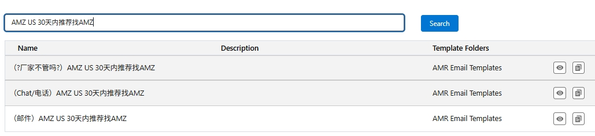
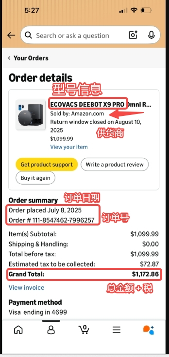
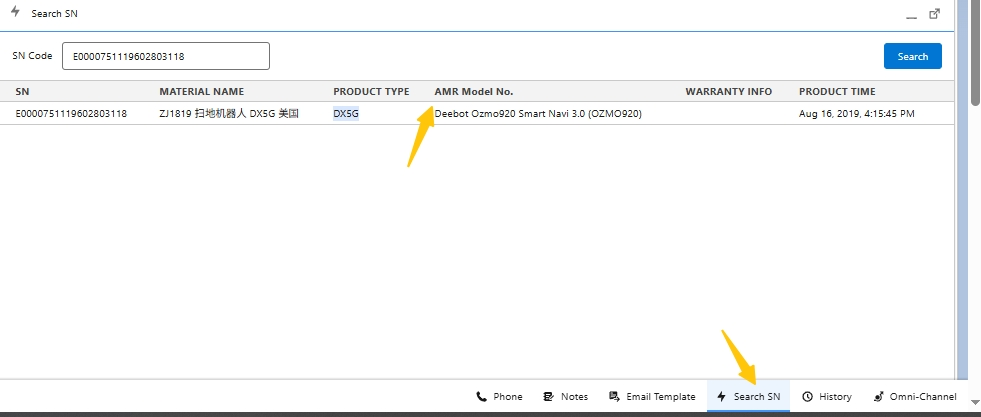
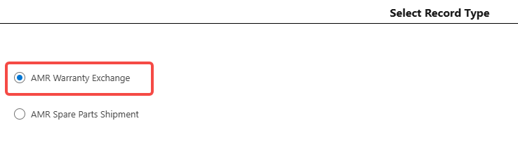
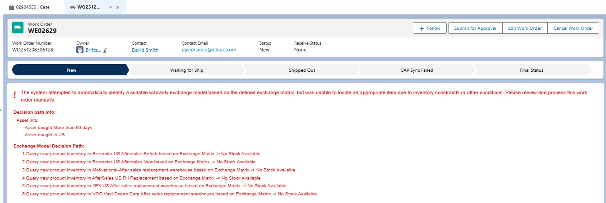

# 二、售后处理流程

### 故障设备常规处理流程（Faulty Devices Handling Process）

#### 1\.1 北美地区保修政策

##### 1\.1\.1（用户端\) 北美官方品牌保修政策

[官网保修政策原文（US）](https://help.ecovacs.com/us/support/warranty)

##### 1\.1\.2（客服端\) 北美新质保政策/保修政策验证流程（2026年6月15日生效\)

###### 1\.1\.2\.1 以“主流销售平台”和“非主流销售平台”判断后续验证保修的流程

**自2026年6月15日开始**，取消以“授权渠道”与“非授权渠道”来判断用户的机器是否可以享受品牌质保服务；取而代之，使用**“****主流销售平台****”**与**“****非主流销售平台****”**为依据，来进一步判断机器的**质保开始时间/Warranty Start Date**是以购买日期为准，还是以Serial Number（SN）配网激活日期为准。

**质保验证方式：**

**主流销售平台**

- 以购买凭证（订单、发票等）作为质保依据。

- 质保起始日期（Warranty Start Date\) = **购买日期**** **\(Purchase Date）

**非主流销售平台：** 

- 质保起始日期 = **SN 查询到的激活日期**。

- 通过 **SN（序列号）** 查询设备激活日期。

**特殊验证：**

适用于**非主流销售平台购买\(无购买凭证/或翻新机\)**，且**无法通过 SN 查询到设备激活信息**的情况。

**验证方式：** 以机身底部标识的生产日期为基准。

- 质保起始日期 = **生产日期\(如下图\)**** \+ 4个月**

###### 1\.1\.2\.1\.1 主流销售平台

**机器的质保开始日期/Warranty Start Date，等于购买凭证上的购买日期/Purchase Date \(Order Date）。**

- ***主流******销售******平台******，包括******：***

    - *Amazon CA *

    - *Amazon US*

    - *Best**B**uy CA Seller*

    - *Best**B**uy US Seller*

    - *Costco CA*

    - *Costco US*

    - *eBay US Seller*

    - *Target US Seller*

    - *Walmart US Seller*

    - *US DTC*

    - *CA DTC*

###### 1\.1\.2\.1\.1\.1** ****美国****亚马逊30天责任分割**** \- Updated Sep 10, 2026**

**责任范围划分：**

- **归因原则：谁销售，谁负责首道售后**

    由**Amazon US****\(1P\)** 直接销售，30天内的退还/退款建议用户直接通过平台处理为**最快路径**。

- **兜底承诺****：平台解决不了，我们负责到底**

    若平台无法解决，或已超过 30 天，用户随时可以回来找我们，**我们负责到底**。

**处理原则：**

- 对于 **Dead on Arrival \(DOA\)** 或购买后 **30 天内** 的售后问题，一线客服在完成排障且确认无法解决后，若用户自行提及在**30天****的亚马逊退换期**内，且表示急迫需要快速的解决方案，可建议用户联系 **Amazon US****\(1P\) **申请换货、退款或价保——**直接通过平台处理为最快路径**。

    - 可向用户说明，通过 Amazon 完成换货后，**产品质保期将重新计算**。

    - 沟通时应**保持中立**，不贬低或比较双方售后流程，**避免给用户造成我方推诿责任的印象**。

    - 留后路：**平台解决不了、或****超过 30 天****，随时回来找我们，****我们负责到底。**

**内部口径提醒：**

1. **禁止说**： "This is not our responsibility" / "Please contact Amazon instead" —— 禁止把用户往外推。

2. **禁止暗示用户找错了/买错了** —— 归因于 "订单由平台销售" 这个客观事实，不归因用户行为。

3. **邮件里给出具体操作步骤** \(Your Orders → Return or Replace\)，减少用户“不知道该去哪”的阻力，用户更愿意配合。

4. **留后路是降对抗的关键**：结尾必须带上“30天以上货平台处理不了，我们负责到底”，用户才不会有被抛弃感。

**可参考话术：**

**一句话速答（用户追问"为什么不找你们"时）：**

Since your order was sold directly by Amazon, they're the ones authorized to process returns and refunds within the first 30 days — and they can do it instantly from your order page, which is why we point you there first\. Anything beyond that, or anything they can't handle, we're happy to take over\. 

**Chat/电话话术模板：**

Thank you for reaching out\! I completely understand you'd like to get this resolved quickly\.

A quick heads\-up: your device was purchased directly from Amazon, and for orders within the first 30 days, Amazon handles returns, replacements, and refunds directly — that's actually the fastest way to get this sorted, since they can process it right from your order page\.

Here's how: go to Your Orders in the Amazon app, find this order, and choose "Return or Replace" — it usually takes just a couple of minutes\.

And just so you know, if anything is outside the 30 days, or Amazon isn't able to help, we're absolutely here for you — just come back to us, and we'll take it from there\.

**邮件模板：**

Thank you for contacting ECOVACS support — we're glad you reached out, and we want to help you get this resolved as quickly as possible\.

To make sure you get the fastest service: your device was sold and shipped directly by Amazon\.com\. For purchases within the first 30 days, Amazon handles returns, replacements, and refunds directly through your account\. Since they're the seller of record, they can process your case immediately from the order page — which is quicker than a manufacturer claim\.

Here's what to do:

1. Sign in to your Amazon account \(app or website\)\.

2. Go to "Your Orders" and locate this order\.

3. Select "Return or Replace" \(or "Contact us" under the order\) and follow the prompts\.

    

Please note: For any issue beyond 30 days, or if Amazon is unable to help for any reason, our ECOVACS warranty team is happy to step in — simply reply to this email, and we'll take care of you personally\.

We appreciate your understanding, and we're always here if you need us\.

**可参考模板位置：**

###### 1\.1\.2\.1\.1\.2 美国亚马逊购买至南美国家

- 若用户需要质保服务，**优先引导用户联系 Amazon **售后。

- 若用户无法通过亚马逊完成售后，或被亚马逊反推至我方，可**升级至 Tier 2/Team Lead 向HQ申请特殊退款****——请勿擅自承诺用户。**

- 若仅需更换**备件或耗材**即可解决问题，可升级至 **Tier 3 \(****Winnie****\)****评估**是否可**寄送备件至用户所在地。**

- 若故障必须经过拆机维修且***工装标定***，应可**升级至 Tier 2/Team Lead 向HQ申请特殊退款****——请勿擅自承诺用户。**

    *PS：工装标定定义如下*

    *当更换以下配件或涉及相关拆装操作时，需进行对应的****工装标定/Calibration Tooling****：*

    *更换主板；*

    *拆装或更换各类传感器，包括但不限于：*

    *结构光传感器*

    *AI 摄像头*

    *沿边/沿面传感器*

    *单线结构光避障传感器*

    *激光传感器（线束激光传感器）等 *

    *更换可能导致传感器安装角度或位置发生变化的配件，例如撞板模组等。 *

    *为确保传感器定位准确及设备正常运行，维修完成后需执行相应的工装标定。*

###### 1\.1\.2\.1\.2 非主流销售平台

**机器的质保开始日期/Warranty Start Date，等于机器Serial Number （SN）****的****配网****激活时间**** ****（不再区分型号，不再区分是否授权渠道）。**

**Amazon Resale**属于**非主流销售平台****，**请使用机器**SN的配网激活时间**作为该机器的质保开始日期;

用户表示机器为**礼物或他人赠与****，**请使用机器**SN的配网激活**时间作为该机器的质保开始日期;

- 用户提供了机器的SN后，先通过Salesforce系统**全局搜索****/Search All**确认该SN是否有换机的记录，**避免非必要升级或错误承诺质保**

- 如确认该SN存在同一用户的换机记录（有关联的换机WO, SN状态为Destroyed），则以重复质保（Duplicate Claim）为由拒绝质保

- 如核实不存在上述无质保效益的情况，则报备至当值的**Tier 2/Team Leader**，将内部升级至HQ以验证该**机器SN的配网激活时间**（内部信息，请勿向用户提供\)

###### 1\.1\.2\.1\.3 各品类科沃斯机器对应的质保时长（Service Terms）\- Effective 2026\-8\-12 GMT\+8

在确定了机器的**质保开始日期**是与“**购买日期**”还是与“**SN配网激活日期**”对等后，参照以下质保时长表进行处理：

|**产品类型**|**保修期**|**是否享受一年礼遇**|
|---|---|---|
|全线地宝|1 年|**是**|
|全线窗宝|1 年|**是**|
|2026 A\&O 割草机|1 年|**是**|
|Amazon Resale 机器|1 年|**否**|
|WOOT/WOOT LLC 等渠道购买的低价机器|1 年|**否**|
|2025 A\&O 割草机|2 年|**否**|
|割草机 GX\-600|整机2年，电池1年|**否**|
|泳池机器人|1 年|**否**|
|亲宝|1 年|**否**|

***最新 BER/EOL 地宝型号，包括***

*WINBOT X*

*DM80 Pro/DM81 Pro*

*DN79/DN79S/DN79SE/DN79W*

*D500/D600/D601/D661/D665/D710/D711/D711S/D901/D907*

*OZMOU2/OZMOU2 Pro/OZMOU2SE*

*OZMO610/OZMO920/OZMO930/OZMO937/OZMO950/OZMO960*

*OZMON7/OZMON8/OZMON8\+/OZMON8P/OZMON8P\+/OZMON8W\+/OZN8PW\+*

*OZMOT5/OZMOT8/OZMOT8\+/OZT8AIVI/OZT8AI\+*

***2025 A\&O系列割草机，包括：***

*GOAT A3000LiDAR*

*GOAT A2500RTK*

*GOAT O1000RTK*

***2026 A\&O系列割草机，包括：***

*GOAT A3000LiDAR PRO*

*A2000 LiDAR PRO*

*O1000 LiDAR PRO*

*O1000 RTK Care Kit*

##### 1\.1\.3 保修服务后保修期计算

（1）保修更换/修理并**不会**重新开始保修期，更换产品仅继承原保修的剩余时间或90天（以较长者为准）；

（2）任何情形的一次性例外维修/更换服务，均不会提供额外的保修期，及提供维修后的**90天**保修服务。

###### 1\.1\.2\.1\.4** 购买日期/SN配网激活日期****大于****24个月（购买超过2年\)**

按“过保”处理，参考“[**购买日期大于24个月（购买超过2年）**](https://lmgx8md8u1.feishu.cn/wiki/VeKqwnu57iEJimkLYX2caEqoneh?renamingWikiNode=false#share-JaxzdpeEdoT9K8xbo7lc5tZxn1d)“进行婉拒，并推荐保外服务中心。

###### 1\.1\.2\.2 官方翻新机

**一般情况：官方认证的**翻新机器我们提供**90天的保修**

（1）客户通过售后渠道获得的官方翻新机

（2）Ebay的Yeedi商店售出的官方翻新机

注意：任何不确定是否官方认证可以跟Tier2/Team Leader/AMR确认

扩展信息： [Authorized Factory\-Renewed Products 描述](https://lmgx8md8u1.feishu.cn/wiki/R5q2wNMVDip8ltkkT8Ocau1qnNd#share-GiicdMzvAoTdJUxyRdHcAt4bnnV)

###### 1\.1\.2\.3 维修中心维修后的机器保修

经过维修中心换机的机器是有90天的保修期（自从**维修中心寄出日**开始计算），如果在此期间用户联系我们，我们是可以提供保修的。

注意：换机后90天内，只要客户反映机器有问题的，都可以享受保修，不要求针对同一故障。

###### 1\.1\.2\.4 人为拆机或损坏的情况

人为拆机或损坏的情况均不提供保修服务，详细条款见[www\.ecovacs\.com/us/support/warranty](http://www.ecovacs.com/us/support/warranty)

###### 1\.1\.2\.5 测试机的保修

测试机，即Ecovacs给个人发放的测试样机。请使用下面邮件模板来收集信息，每个测试机的warranty都不一样，以**具体协议**为准。

#### 1\.2 执行步骤（Operation Steps）

##### **1\.2\.1 验证机器是否符合保修 （Verify product warranty）**

依照[**（客服端\) 北美新质保政策/保修政策验证流程（2026年6月15日生效\)**](https://lmgx8md8u1.feishu.cn/wiki/VeKqwnu57iEJimkLYX2caEqoneh?renamingWikiNode=false#share-Q580dttVHo9WmAxZA1Lc7AB0n3d)** **执行

###### 1\.2\.1\.1  用 Collect Info 邮件模板收集客人机器的SN等信息。

###### 1\.2\.1\.2  判断机器保修状态

依照[**各品类科沃斯机器对应的质保时长（Service Terms）**](https://lmgx8md8u1.feishu.cn/wiki/VeKqwnu57iEJimkLYX2caEqoneh?renamingWikiNode=false#share-PZqDdwG4boOj21xLv8WcF3WAnYc)执行；

###### 1\.3\.1\.3  亚马逊购买凭证判断

**亚马逊购买凭证**不论是手机版截图还是网页版截图，**均可用于验证**。只需确保购买凭证包含以下5大关键信息即可：

**手机版：**

**网页版：**

#### 1\.4 特殊售后流程

**参考**[**维修中心切换过渡时期特殊处理流程**](https://lmgx8md8u1.feishu.cn/docx/QgAbdVEWnoKWEkxxRrIcG590nnb#doxcnV3HkiX1Y178T4DAsW8crOg)

### 2\. 维修中心切换过渡时期特殊处理流程（Consultation on Repair\-related Scenarios:）

#### 2\.1 流程说明

自2025年4月1日起，我们将切换新的维修中心。在过渡期间，我们**对于所有保内的机器一律提供换机，不提供维修****（****以换代修****）****。**

#### 2\.2 操作步骤（Operation Steps）

1. 收集用户信息及**设备****Serial Number****;**
*设备**Serial Number**必须要用** ****Search ******SN**** **功能验证机器是否为用户购买的机器，若不一样要和用户再次确认*

2. 点击**Create AMR Work Order**去创建保修工单，取决于用户机型是否需要寄回发送不同邮件模板告知用户

3. 若不缺货，点击'AMR dispatch‘帮用户保修即可；若缺货，系统会以**红字**显示，此时，我们需要用Post把case升级到**Tier 3 \(****Winnie****\)**** **名下让他安排换机

    - 仓库一旦发货，WO的状态会更新为'**Shipped out**‘，同时WO处的’**Dispatch Label Tracking No**'会更新

4. 向用户发送邮件，通知新机的**Tracking\#**和换机的机型（由于库存原因，换机机型可能会和原始机型不一致，**务必要告知用户换机机型**，万一出现了**机型降级**的情况一下要及时向Tier 2/Team Leader反馈）。

***重要提醒（内部信息，请勿对外跟用户透露\)：****在质保换机流程中，系统将根据用户的****原机器购买日期/Date of Purchase/Warranty Start Date****自动匹配全新机或翻新机——在成功创建Work Order \(WO\)后，****在点击AMR Dispatch发货前****，****需要进一步******检查WO中所填写联系人信息、地址、所选AMR Model No\.、机器的Serial Number等是否都准确无误。***

***系统替换机匹配逻辑（内部信息，请勿告知用户\)——最新Exchange Matrix已上线，正常情况下不需要Tier 3手动调整机型，除非出现"缺货提示“；***[***出现缺货，请参考"升级至Tier 3"相关流程要求进行必要的升级***](https://lmgx8md8u1.feishu.cn/wiki/VeKqwnu57iEJimkLYX2caEqoneh?renamingWikiNode=false#share-OrxPdNqpUoPzMSxcggUcj9J0n1f)***。***

- *Purchase Date \<=3 Months, 系统将优先匹配全新机——如果出现系统匹配机型错误（即没有安排全新机\)，升级Tier 3进行调整；*

- *3 months \< Purchase Date ≤ 6 months，系统优先匹配A类翻新机, A类翻新机缺货，将自动匹配全新机——如果系统匹配机型错误（即低于A类翻新机），升级Tier 3进行调整；*

- *6 months \< Purchase Date ≤ 12 months，系统优先匹配机型的优先级为: B类翻新机 \> A类翻新机 \> 全新机；*

- *12 months \< Purchase Date ≤ 24 months，系统优先匹配机型的优先级为: C类翻新机 \> B类翻新机 \> A类翻新机 \> 全新机；*

#### 2\.3 原设备寄回规则 

##### 2\.3\.1 生效日期及适用情形

从**2026年9月20日**起，以下**适用机型**在购买时间/激活时间**不超过（小于等于）****6****个月**的情况下，用户必须将**原设备寄回**：

1. X系列：X8、X9、X9S、X11、X11S、X12、X12S

2. T系列：T50、T50S、T80、T80S、T90、T90S

3. 割草机\(除了**GOAT GX600不需要退，其他都退**\):

需要寄回：

- GOAT O1\-1000 RTK系列、GOAT O1000 LiDAR 系列

- GOAT A2000 LiDAR 系列

- GOAT A1\-2500 RTK系列

- GOAT A1\-3000 LiDAR系列

对于**其他型号（包括****所有****窗宝，泳池、****亲宝LilMilo****）**，用户**无需寄回原来的设备**。

**后续的新品需要同步更新上需要寄回的表单中。**

##### **2\.3\.2 原设备寄回规则更新时间线**

|序号|更新日期|政策更新|备注|
|---|---|---|---|
|1|2025/6/16 |以下**适用机型**在购买时间**不超过（小于等于）9个月**的情况下，用户必须将**原设备寄回**： **适用机型**：DEEBOT X2、X5、X8、X9、X11、T30、T50、T80; GOAT O1000、A2500、A3000**系列** 所有的Winbot目前不需寄回。||
|2|2025/12/26 |以下**适用机型**在购买时间**不超过（小于等于）9个月**的情况下，用户必须将**原设备寄回**： **适用机型**：**~~DEEBOT X2~~**、X5、X8、X9、X11、T30、T50、T80; GOAT O1000、A2500、A3000**系列** 所有的Winbot目前不需寄回|X2不必寄回 |
|3|**2026/6/9** |DEEBOT X5、X8、X9、X11、T30、T30C、T50、T50 Max, T50S、T80、T80S、T90/X9S、X11S、X12; GOAT O1000RTK、A2500RTK、A3000LiDAR、GOAT O1000RTK Care Kit、O1000LiDAR PRO、A2000LiDAR PRO、A3000LiDAR PRO、泳池机器人UltraMarine P1 对于**其他型号（包括****所有****窗宝，****亲宝LilMilo****，及GOAT GX600）**，用户**无需寄回原来的设备** [北美流程整合（V260617 质保流程重大更新）](https://lmgx8md8u1.feishu.cn/wiki/VeKqwnu57iEJimkLYX2caEqoneh?renamingWikiNode=false#share-V6MJdFVgkoenSmxTBxhcGGWunYf)|改为购买6个月内寄回设备 |
|4 |**2026/9/17**|DEEBOT X5、X8、X9、X11、~~T30、T30C~~、T50、T50 Max, T50S、T80、T80S、T90/X9S、X11S、X12; GOAT O1000RTK、A2500RTK、A3000LiDAR、GOAT O1000RTK Care Kit、O1000LiDAR PRO、A2000LiDAR PRO、A3000LiDAR PRO、 对于**其他型号（包括****所有****窗宝，****泳池机器人UltraMarine P1、****亲宝LilMilo****，及GOAT GX600）**，用户**无需寄回原来的设备**|改为T30系列和泳池机器人P1不退回|
|5|**2026/9/20** |从**2026年9月20日**起，以下**适用机型**在购买时间**不超过（小于等于）****6****个月**的情况下，用户必须将**原设备寄回**： 1. X系列：X8、X9、X9S、X11、X11S、X12、X12S 2. T系列：T50、T50S、T80、T80S、T90、T90S 3. 割草机\(除了**GOAT GX600不需要退，其他都退**\): 4. 对于**其他型号（包括****所有****窗宝，泳池、****亲宝LilMilo****）**，用户**无需寄回原来的设备**。|X5不寄回 |

##### 2\.3\.3 执行步骤

\>Salesforce系统目前WO会对Serial Number查重，若该Serial Number已经有换机的WO（进行中或已关闭），则无法创建新的WO，系统会有提醒；

\>原Zendesk系统的部分工单，仍记录在[失效SN登记表](https://lmgx8md8u1.feishu.cn/sheets/Cv6Us9tH9ht0QKtJajgcanmenNf?from=from_copylink)中的“**保修服务失效SN**”中，agent可通过此表查询客户之前是否在切换系统前进行过换机。

2025/12/16起，[失效SN登记表](https://lmgx8md8u1.feishu.cn/sheets/Cv6Us9tH9ht0QKtJajgcanmenNf?from=from_copylink)仅仅作为查询用途，**无需再进行手动新增**

###### 2\.3\.2\.1特殊情形处理

如遇到以下情况：

例，如果张三旧机Serial Number用户**已经退回**，被**Besender翻新**给了李四。李四翻新机质保期内需要再次换机，需要在原Asset更新contact给李四，并更新机器新的质保开始和结束日期——**目前这部分，需要操作时 *****请联系Tier 2/******Team Leader****** 进一步核实，由Tier 2/******Team Leader****** ******代为操作，直至另行通知******。***

准确地说，在以上例子中：

1. 如果给张三创建了一个WorkOrder，其关联Asset的Serial Number为"E123"。

2. 如果尝试给李四创建一个Serial Number也为"E123"的WorkOrder，系统会**阻断**WorkOrder的创建, **报出错误提示：****Serial Number****重复/****Serial Number****已存在**。

##### **2\.3\.****4**** 注意事项**：

- 回邮标签有效期：

|**承运商**|**标签起算期**|**标签有效期**|**使用地区**|
|---|---|---|---|
|FedEx |自用户**打印之日**起算|14天|美国|
|UPS|自创建日起算|90天|美国（基本弃用）|
|USPS|自购买/创建日起算|28天|部分偏远地区|
|Purolator |邮件中的下载链接 **5 天失效** |下载并打印后无系统有效期限制**；**对外统一口径：**有效期 30 天**|加拿大 |

- 如果用户在**回邮标签失效前**因特殊原因未能寄出**原机器**，但之后再次联络我们，请通知Tier 2/Team Leader，让他们为用户创建新的shipping label。

- 若用户要求上门取件服务，确认用户方便的时间后，把case升级给Tier 2/Team Leader做预约处理

- 识别货运商名称

旧机**回邮标签/Return Label**目前为FedEx （美国用户）或Purolator（加拿大用户）两种，常见tracking\#示例 如下：

**FedEx**: 885XXXXX7493

**Purolator**: EWVXXXXXXX70 \(虽然Besender平台依旧显示“货运商/Carrier"为UPS\)

相关Email Template使用时请对应修改，**删除**不适合情景的Carrier名称。

**Macro 5 \- Inform Label Status**

**Macro 6 \- Inform Replacement's Tracking \& Remind to Ship Original Machine**

**完整的流程及对应****邮件模板****参考此文档: **[Warranty Replacement Process](https://lmgx8md8u1.feishu.cn/docx/TQ35dIWGpoz8eMxP9D0cgAJknwf?from=from_copylink)
*附**SF **邮件模板**路径*

#### 2\.4 特殊岛屿区域处理流程

目前售后仓库无法发机器到特殊岛屿区域（如Hawaii和Puerto Rico），如果该区域用户进线寻求保修，正常收集完信息后（POP，Serial Number号，视频缺一不可），用**以下话术（截图所示）**收集用户资料，用户回复完之后，回复升级专用回复模板，**必须**将工单**升级至Tier 3 \(****Winnie****\) 处****确认退款还是换机：**

**若退款，需升级给****Tier 2****/****Team Leader****进行后续跟进。**

- *（直至另行通知\) 后续遇到 ****PR\-Guaynabo（邮编 00968、00969）**** 的订单时，****无需升级至 Tier 3 确认换机或退款方案，请直接选择退款选项。***
*目前发现该区域的换机物流成本较高，相关费用约为 ****$700–$800/台****，****无需向客户透露此信息****。*
*其他 Puerto Rico 地区目前暂未发现类似情况，****按照正常流程处理即可****。*

**若换货，请按照****Tier 3****指引处理下一步。**

特殊岛屿区域包括：

- Hawaii

- Alaska

- Puerto Rico

- Guam

- U\.S\. Virgin Islands

- Northern Mariana Islands

- American Samoa

### **3\. 产品****过保**** ****（****1年品牌质保已过****）****处理流程（****One\-time**** Courtesy ****Service ****Process）**

（此流程除了特殊提供延保的GOAT和地宝外其他机型都适用）
*注**1**：Woot/other discount retailers 提供 12 个月的保修，不提供延长保修\.（2025年9月4日更新）*
*（如无法确定other discount retailers，请升级**Team Leader**/**Tier 2**）*

*注2：如果用户在特殊岛屿地区购买的亚马逊订单，则无法享受特殊延长保修服务*

#### 3\.1 常规处理流程（Handling Flow）

#### 3\.2 执行步骤（Operation Steps）

##### 3\.2\.1 购买日期小于24个月

只要用户购买日期在**两年以内**，我们都可以提供保修，但必须强调：

- ECOVACS **官方保修为****1****年****/12个月**

- 这次是因为对方是忠实客户，**破例提供一次性的免费特殊保修服务**** **\(即内部提供的1年礼遇服务，俗称提供One\-time Courtesy Service）

    - **邮件模板：**Offer OOW Courtesy Service \(No BSD/IFR\<24 months\)

- 创建完WO之后请用邮件模板 **OOW ****Courtesy ****\- No Need to Return Original Machine**** **告知用户保修流程（请**不要使用**普通的**Macro 2 \- No Need to Return Original Machine**的邮件模板）

##### **3\.2\.2 购买日期****大于****24个月（购买超过2年\)**

###### **美国 \- BESENDER**

自购买日期起，已经**超过2年**的机器，不再享受1年品牌质保或OOW One\-time Courtesy Service, 指引用户联系 **BESENDER **进行**保外服务**或**购买维修配件**的咨询

***指引用户联系******BESENDER******后，请选定Case Tag \> ******US OOW Case******进行标记***

- **维修****：**\(购买超2年\) US OOW **BESENDER** 邮件模板

- **购买****耗材类****配件****：**\(购买超2年\) US OOW **BESENDER **\- **Buy Parts****/Accessories**** **邮件模板

###### 加拿大 \- ATRAVESAR SERVICES——Effective on 2026\-8\-11 21:00 GMT\+8

自购买日期起，已经超过2年的机器，不再享受1年品牌质保或OOW One\-time Courtesy Service, 转移case给 **ATRAVESAR SERVICES **进行保外服务咨询。

**9/18变更总结：从人工收集信息报价、答疑，变成同步报修表单给用户，让用户自助操作**

ATRAVESAR SERVICES保外自助报修表单：https://www\.atravesar\.ca/OOW\-Webform/

**邮件模板：**\(购买超2年\) CA OOW \- Atravesar Services

Thank you for contacting ECOVACS\. We've taken a close look at your purchase record, and we're sorry to let you know that your machine is now past the one\-year warranty period, so it's no longer covered under our standard warranty service\.

That said, we do want to help you get it fixed\. For machines out of warranty in Canada, we work with **Atravesar Services**, a trusted ECOVACS partner service center, who can professionally diagnose and provide service for you\.

Getting started is simple — just 3 steps:

1. **Fill in the form with your details **[**Atravesar Services Repair Request form**](https://www.atravesar.ca/OOW-Webform/)

2. **Receive your quotation** and payment link

3. **Pay and ship** your unit to the repair center

A few quick notes:

1\. The inspection fee is CAD 40, payable upfront\.

If you choose to go ahead with the repair, the CAD 40 will be applied toward the repair fee\.

2\. No pressure: if you'd rather not continue after inspection, we'll simply send your machine back\.

**Repair Center:** Dock 5, 145 Riviera Dr, Markham, ON L3R 5J6, Canada

Repairs take about 72 hours after your unit arrives\. 

Feel free to reply here if you have any questions — we're happy to help\.

##### 3\.2\.3 购买日期大于24个月但小于36个月

目前甲方很重视客户满意度，如果是**购买日期****＞24个月但＜36个月（3年内）**的用户，且用户情绪比较沮丧激动或者涉及到差评法律威胁，和Tier 2/Team Leader确认后，可以**升级给Tier 3 \(****Winnie****\)**寻求one\-time courtesy以换代修服务。

##### 3\.2\.4 OOW例外服务后续（3\.2\.1和3\.2\.2情形均适用）

1. 明确告知客户，本次维修属于一次性例外维修服务且不会额提供额外的保修期限

When offering a one\-time courtesy service, the agent must clearly inform the customer that:

①This service is a** one\-time** courtesy\.

**②No additional warranty** will be provided for this service\.
补充：这只是给用户提醒的，如果用户反馈有问题我们还是可以提供保修（此为\*\*\*内部信息\*\*\*请勿传达给客户）

2. 客户在一次性例外维修服务后再次联系，维修后90天内都可以提供保修服务。

3. 任何复杂或不确定的情形

    - If the issue cannot be clearly identified or the situation is difficult to assess:

        - Escalate the case to Tier 3 for a final decision\.

### 4\. 配件和内部零件处理流程（Complimentary Accessories/Parts）

#### 4\.1\.定义（Defination）

区分：耗材、一般配件、内部配件/内部零件

|分类|定义|备注|示例|质保计算|补发策略|
|---|---|---|---|---|---|
|Accessories 耗材 |理解为耗材，一般指机器在使用过程中会消耗或磨损的物品，建议定期更换|This category includes supplementary items that enhance or complement the main products, often sold separately\. |边刷、主刷、尘袋、抹布、滤芯、清洁液等 |不涉及特定的质保，一般来说用户来申请都会发给用户 |若用户愿意自行购买且官网可购入，提供Coupon和对应部件的购买链接即可。  在保：若用户要求我方提供，免费补发。  过保：引导购买 无销售渠道：免费补发 |
|Service Parts |理解为一般的配件，一般指辅助主设备功能的附加物品|To ensure that maintenance and repair components for Ecovacs products are properly managed, service parts and internal components are not available for direct sale to the public\. Access to these parts is limited to authorized service providers and specific repair channels\.|尘盒、抹布支架 、普通水箱、强拖水箱 |跟机器质保 |在保：免费补发 过保：升级Tier 3申请补发 BSD无库存：质保换机 |
|Internal Parts|理解为内部零件，绝大部分的内部零件都需要用户进行拆机更换 ||如SKU表中看到机器内部元件 ||在保：质保换机 过保：升级Tier 3申请 BSD无库存：升级Tier 3申请BSD购买链接/回收部件发送 |

#### 4\.2 执行步骤：

##### 4\.2\.1 耗材（Accessories）

1. 指引客户通过官网渠道购买：
美国：[https://www\.ecovacs\.com/us/deebot\-winbot\-accessories](https://www.ecovacs.com/us/deebot-winbot-accessories)
加拿大：https://www\.ecovacs\.com/ca/deebot\-winbot\-accessories

2. 推荐用户去Amazon购买

注意：如果推荐用户去亚马逊买配件，给的链接必须是我们官方的。即美国亚马逊seller必须是[Amazon\.com](http://Amazon.com) , 加拿大seller必须是Ecovacs Robotics**。**非官方的seller链接不能发。

##### 4\.2\.2 一般配件 \(Service Parts\)

1. **验证保修期（Verify warranty）**

依照[**（客服端\) 北美新质保政策/保修政策验证流程（2026年6月15日生效\)**](https://lmgx8md8u1.feishu.cn/wiki/VeKqwnu57iEJimkLYX2caEqoneh?renamingWikiNode=false#share-Q580dttVHo9WmAxZA1Lc7AB0n3d)** **验证。

2. **根据保修期内/外情形，按以下说明执行**

**客户仅需购买配件\(Service Parts\)，无需维修：**

先找到对应部件的 **SKU**，到 **\(客服端\) Besender网站**确认客户所需部件是否有**可操作**库存。

1. **若有库存**：

    请使用以下话术收集客户信息，**创建Work Order**发送配件。

    **使用话术：**

2. **若无库存**：

    - 前往配件到货 ETA 表格查询未来库存情况

    [BSD Parts PO Tracking](https://ecovacs.feishu.cn/sheets/JzKOsmaqdhoeZxtg93ycTnS0nUb?from=from_copylink&sheet=cLDTFt)

    - 若表格中显示该配件近期会补货：

    → 根据 ETA 时间告知用户，并询问其是否愿意等待。

    - 若查无相关到货信息，或用户明确表示不愿意等待：

    → **若用户在保修期内**，必须为客户提供**替补方案**：直接为用户走**正常保修流程**。

    → **若用户在保修期外**，客服仍须为其提供**替补方案**：升级至**Tier 3\(****Winnie****\)处**，确认是否可以**提供购买链接****、****回收所需部件****或****提供一次性礼赠服务**。

    →同时，**报备Tier 2， Team Leader****。**

##### 4\.2\.3 **内部零件 \(Internal Parts\)**

1. **验证保修期（Verify warranty）**

依照[**（客服端\) 北美新质保政策/保修政策验证流程（2026年6月15日生效\)**](https://lmgx8md8u1.feishu.cn/wiki/VeKqwnu57iEJimkLYX2caEqoneh?renamingWikiNode=false#share-Q580dttVHo9WmAxZA1Lc7AB0n3d)** **验证。

2. **根据保修期内/外情形，按以下说明执行**

    

    **→****若用户在保修期内**，告知和提醒用户：客服端不推荐自行拆机安装内部零件，否则原机器质保将失效。但必须为客户提供**替补方案****——**直接为用户走**正常保修流程**。

    →**若用户已在保修期外**，则**无需提醒**自行拆机导致质保失效（因质保已失效）；但客服仍须为其提供替代方案。

    - 先找到对应部件的 **SKU**，到 **\(客服端\) Besender网站**确认客户所需部件是否有**可操作**库存。

    1. **若有库存**：

        请使用以下话术收集客户信息，**创建Work Order**发送配件。

        **使用话术：**

    2. **若无库存**：

        - 前往配件到货 ETA 表格查询未来库存情况

        [BSD Parts PO Tracking](https://ecovacs.feishu.cn/sheets/JzKOsmaqdhoeZxtg93ycTnS0nUb?from=from_copylink&sheet=cLDTFt)

        - 若表格中显示该配件近期会补货：

        → 根据 ETA 时间告知用户，并询问其是否愿意等待。

        - 若查无相关到货信息，或用户明确表示不愿意等待：

        → **若用户在保修期外**，客服仍须为其提供**替补方案**：升级至**Tier 3\(****Winnie****\)处**，确认是否可以**提供购买链接****、****回收所需部件****或****提供一次性礼赠服务**。

        →同时，**报备Tier 2， Team Leader****。**

    

#### 4\.3 特殊情况

##### 特殊情形1：用户无法通过任何渠道购买的到需要的耗材/配件

1、客户产品无法通过任何渠道购买的到需要的耗材/配件，应直接为客户创建WO申请；

2、执行步骤：

**首先在 Besender 系统查询配件库存情况**：

- 若 **有库存**：可直接使用下面的邮件模板收集用户信息后**创建 WO 进行补发**。

- 若 **无库存**：前往配件到货 ETA 表格查询未来库存情况

[BSD Parts PO Tracking](https://ecovacs.feishu.cn/sheets/JzKOsmaqdhoeZxtg93ycTnS0nUb?from=from_copylink&sheet=cLDTFt)

- 若表格中显示该配件未来会补货：

→ 根据 ETA 时间告知用户，并询问其是否愿意等待。

- 若查无相关到货信息，或用户**明确表示不愿意等待**：
→ 客服仍须为其提供**替补方案**：升级至**Tier 3\(****Winnie****\)处**，确认是否可以**提供购买链接****、****回收/harvest 所需部件**。

##### 特殊情形2：GOAT A2500RTK / GOAT A3000 LiDAR / A2000 LiDAR PRO 电池需求。

1. 若正常排障后确认是机器电池问题，则**无需提醒**自行拆机，以免导致质保失效。

2. 先找到对应部件的 **SKU**，到 **\(客服端\) Besender网站**确认客户所需部件是否有**可操作**库存。

- **若有库存**：

    - 请使用以下话术收集客户信息，**创建Work Order**发送配件。

    - **使用话术：**

- **若无库存**：

    - 前往配件到货 ETA 表格查询未来库存情况

    [BSD Parts PO Tracking](https://ecovacs.feishu.cn/sheets/JzKOsmaqdhoeZxtg93ycTnS0nUb?from=from_copylink&sheet=cLDTFt)

    - 若表格中显示该配件近期会补货：

    → 根据 ETA 时间告知用户，并询问其是否愿意等待。

    - 若查无相关到货信息，或用户明确表示不愿意等待：

    → **若用户在保修期内**，必须为客户提供**替补方案**：直接为用户走**正常保修流程**。

    → **若用户在保修期外**，客服仍须为其提供**替补方案**：升级至**Tier 3\(****Winnie****\)处**，确认是否可以**提供购买链接****、****回收所需部件****或****提供一次性礼赠服务**。

    →同时，**报备Tier 2/Team Leader****。**

#### 4\.4 法律基础

个别型号短期无货时,客服若直接说"这个型号不再有库存/没有配件了",有法务和舆论风险。详情参见文件。

[美加售后备件 — 客服法律基础意识普及（精简版）](https://ecovacs.feishu.cn/wiki/Oup9wVFAjiBFoVkpPfzcP4Zznqc)

### 5\. 账号/数据删除流程（Delete Account/Data SOP）

#### 5\.1  删除账号

##### 5\.1\.1 常规处理流程

##### **5\.1\.2 特殊说明**

1. 接到删除账号请求必须要先建议用户在APP内自行删除，若用户不同意在APP中自行删除，则通知Tier 2/Team Leader处理。

2. 在升级Tier 2/Team Leader 处理删除账号请求之前，**必须确认待删除邮箱与用户当前的联络邮箱是否一致**。 如不一致，需要求用户使用待删除账号的邮箱重新提交删除账号请求（发邮件至客服邮箱support\.us@ecovacs\.com并附带当前工单号）。

##### **5\.1\.3 回复话术（Tier 2/Team LeaderONLY）**

Dear Mr\./Ms\. \[Last Name\],

We acknowledge the receipt of your account deletion request associated with the email address \[XXX@XXX\.com\]\. Your request is currently being processed and will be completed within **45** business days\.

We appreciate your understanding and patience during this time\. Should you have any further questions or need additional assistance, please don't hesitate to reach out\.

#### **5\.2 删除数据**

##### 5\.2\.1 常规处理流程

##### **5\.2\.2 特殊说明**

1. 在升级HQ处理删除数据请求之前，**必须确认待删除数据邮箱与用户当前的联络邮箱是否一致**。如不一致，需要要求用户使用待删除数据的邮箱重新提交删除数据请求（发邮件至客服邮箱support\.us@ecovacs\.com并附带当前工单号）。

2. 升级时必须写清楚，是要删除账号、删除数据、还是同时删除账号和数据。**无论是后台删除账号还是删除数据都是交给****Tier 2****/****Team Leader****操作，无需Agent操作****。**

##### **5\.2\.4 回复话术****（****Tier 2****/****Team Leader**** ONLY）**

Dear Mr\./Ms\. \[Last Name\],

We are writing to confirm the receipt of your request for data deletion associated with the email address \[XXX@XXX\.com\]\. We will review your request promptly, and you will receive a response **within the statutory time frame **from our data privacy team at [data\-privacy@ecovacs\.com](mailto:data-privacy@ecovacs.com)\.

We appreciate your understanding and patience during this time\. Should you have any further questions or need additional assistance, please don't hesitate to reach out\.

