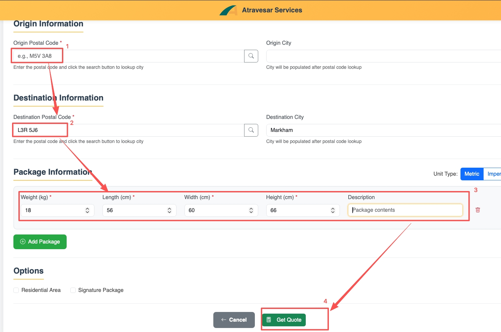

# 历史版本备用\-备份记录用，请客服团队勿用

#### CA OOW 历史版本 \- 已弃用

3\.1 加拿大 \- ATRAVESAR SERVICES——To be Expired on 2026\-8\-11 21:00 GMT\+8

自购买日期起，已经超过2年的机器，不再享受1年品牌质保或OOW One\-time Courtesy Service, 指引用户联系 **ATRAVESAR SERVICES **进行保外服务咨询。

***指引用户联系******ATRAVESAR******后，请选定Case Tag \>****** CA OOW Case******进行标记***

- **邮件模板：**\(购买超2年\) CA OOW \- Atravesar Services **\(建议先给邮箱 **[**service@atravesar\.ca**](mailto:info@atravesar.ca)**\)**

3\.2 加拿大 \- ATRAVESAR SERVICES——Effective on 2026\-8\-11 21:00 GMT\+8**（2026\.9\.18弃用）**

自购买日期起，已经超过2年的机器，不再享受1年品牌质保或OOW One\-time Courtesy Service, 提供初步的报价邮件，用户确认维修，转移case给 **ATRAVESAR SERVICES **进行保外服务咨询。

补充说明：

A\. 关于报价：

保外维修初步报价包含4部分：①往返运费 ②检测费 CAD40 ③维修费（检测费计入）④备件费

①运费：需要对方提供postal code，提供后可以客服可使用 [https://fulfillapi\.atravesar\.ca/api/shipment/quotation](https://fulfillapi.atravesar.ca/api/shipment/quotation)查**往返**预估运费（已提2需求: a\. 注意关注报价币种，改为CAD，减少单位换算工作, USD\*1\.35；b\. 用户→RC→用户的往返费加和计算出来显示在操作界面上）

注：Destination Information处的Postal Code处，填写加拿大维修中心的Postal Code（即L3R 5J6）

②检测费 CAD40（维修后，检测费将计为维修费中，需要先付）

③Options：维修完成后，RC→用户时，需要点选*Residential Area*；如用户要求签名收货（此选项收费更高），点选*Signature Package*

B\. 关于Case更新要求
1、用户确认要保外维修后，必须收集的信息如下：
①AMR Model No\. ②SN  ③购买日期  ④Request Description ⑤ Case tag选择***CA OOW Case（注意：仅用户确认送修才添加此tag）***

2、用户确认要付费维修，则回复模板2，抄送给 ecovacs\.service@atravesar\.ca，便于RC实时了解沟通详情

**C\. 邮件模板1：**\(购买超2年\) CA OOW \- Atravesar Services

Thank you for contacting ECOVACS\. We've taken a close look at your purchase record, and we're sorry to let you know that your machine is now past the one\-year warranty period, so it's no longer covered under our standard warranty or the one\-time courtesy service\.

That said, we do want to help you get it fixed\. For machines out of warranty in Canada, we work with Atravesar Services, a trusted ECOVACS partner service center, who can professionally diagnose and repair your unit\.

To help you decide, here's what an out\-of\-warranty repair involves:
1\. Shipping fee — this covers the total round\-trip shipping cost for sending the machine to the repair center and having it shipped back to you, typically around CAD 60–100 depending on your location\. We can calculate the exact amount based on your postal code\. \(We're located in Markham\)
2\. Inspection fee — CAD 40, payable upfront\.
3\. Repair fee — if you choose to go ahead, the CAD 40 inspection fee will be applied toward the repair\. 
4\. Parts fee — only if any parts need to be replaced\.

If, after inspection, you'd rather not continue, we'll simply send the machine back to you — no pressure at all\.

Want to proceed? Just reply "yes" along with your full mailing address \(including postal code\), and we'll calculate the estimated shipping cost and forward your case to our out\-of\-warranty team\.

A quick note: Payment will be required **before** we receive your product\.

Feel free to reply here if you have any questions — we're happy to help\.

邮件模板2：用户确认要送修后：

Thank you for confirming that you'd like to proceed with the paid repair\.

Here's what happens next:

Your case has been transferred to our repair center for further assistance\. We've also copied ecovacs\.service@atravesar\.ca on this so our service team has everything they need — they'll reach out to you shortly\.

Once the case is handed over, our customer service case will be closed on our end\.

If you receive a survey email about your experience, we'd really appreciate it if you could share your feedback on how our customer service team did\. It helps us keep improving\.

If you have any questions in the meantime, feel free to reply to this email — we're happy to help\.

**FAQ**

**Q: What is the Repair Center \(RC\) address?**

A: Dock 5, 145 Riviera Dr, Markham, ON L3R 5J6, Canada

**Q: How long does a repair take?**

A: Approximately 72 hours from the time your unit is received at our Repair Center\.

**Q: Can I drop off my unit directly at the Repair Center?**

A: Yes, walk\-in drop\-off is welcome at the address above\.

#### 原设备寄回历史版本

#### **2026年6月9日版本**** \- 已弃用**

从**2026年6月9日**起，以下**适用机型**在购买时间**不超过（小于等于）****6****个月**的情况下，用户必须将**原设备寄回**：

**适用机型**：DEEBOT X5、X8、X9、X11、T30、T30C、T50、T50 Max, T50S、T80、T80S、T90/X9S、X11S、X12; GOAT O1000RTK、A2500RTK、A3000LiDAR、GOAT O1000RTK Care Kit、O1000LiDAR PRO、A2000LiDAR PRO、A3000LiDAR PRO、泳池机器人UltraMarine P1

对于**其他型号（包括****所有****窗宝，****亲宝LilMilo****，及GOAT GX600）**，仍按原有流程处理，用户**无需寄回原来的设备**。

#### **2026年9月17日版本**** \- 已弃用**

从**2026年9月17日**起，以下**适用机型**在购买时间**不超过（小于等于）****6****个月**的情况下，用户必须将**原设备寄回**：

|OZMOX5M|DEEBOT X5 PRO OMNI|
|---|---|
|GA\-2000R|GOAT A1\-2000 RTK|
|GA\-2500R|GOAT A1\-2500 RTK|
|GA\-3000L|GOAT A1\-3000 LiDAR|
|GA\-3000R|GOAT A1\-3000 RTK|
|GO\-1000R|GOAT O1\-1000 RTK|
|GO\-1500R|GOAT O1\-1500 RTK|
|OZMOX8MC|DEEBOT X8 PRO OMNI CARE|
|OZT50M|DEEBOT T50 OMNI White|
|OZT50MK|DEEBOT T50 OMNI Black|
|OZT50MKC|DEEBOT T50 OMNI CARE Black|
|OZT50MP|DEEBOT T50 PRO OMNI|
|OZT50MPW|DEEBOT T50 PRO OMNI White|
|OZT50XP|DEEBOT T50 MAX PRO Black|
|OZT80|DEEBOT T80 OMNI|
|OZMOX8M|DEEBOT X8 PRO OMNI|
|OZMOX9M|DEEBOT X9 PRO OMNI|
|OZMOX11M|DEEBOT X11 OmniCyclone|
|GO1000RK|GOAT O1000 RTK Care Kit|
|OZL001|T90 PRO OMNI CARE|
|OZMOX11P|DEEBOT X11 PRO OMNI|
|OZMOX12M|DEEBOT X12 OmniCyclone|
|OZMOX9S|DEEBOT X9S PRO OMNI|
|OZT50S|T50S OMNI|
|OZT50SP|T50S PRO OMNI|
|OZT50SPC|T50S PRO OMNI CARE|
|OZT80SC|T80S OMNI CARE|
|OZT90|DEEBOT T90 OMNI|
|OZX12PC|X12 PRO OMNI CARE|
|GA2000LP|GOAT A2000 LiDAR PRO|
|GA3000LP|GOAT A3000 LiDAR PRO|
|GO1000LP|GOAT O1000 LiDAR PRO|
|GO1000RC|GOAT O1000 RTK Care Kit|
|OZMOX11S|X11S OmniCyclone|
|OZT80S|DEEBOT T80S OMNI|
|OZT90P|T90 PRO OMNI|
|OZX12SM|DEEBOT X12S OMNICyclone|
|OZX11SP|DEEBOT X11S PRO OMNI|
|OZT90SP|DEEBOT T90S PRO OMNI Black|

对于**其他型号（包括****所有****窗宝，泳池、****亲宝LilMilo****，及GOAT GX600）**，仍按原有流程处理，用户**无需寄回原来的设备**。

**原设备寄回规则更新时间线**

|序号|更新日期|政策更新|备注|
|---|---|---|---|
|1|2025/6/16 |以下**适用机型**在购买时间**不超过（小于等于）9个月**的情况下，用户必须将**原设备寄回**： **适用机型**：DEEBOT X2、X5、X8、X9、X11、T30、T50、T80; GOAT O1000、A2500、A3000**系列** 所有的Winbot目前不需寄回。||
|2|2025/12/26 |以下**适用机型**在购买时间**不超过（小于等于）9个月**的情况下，用户必须将**原设备寄回**： **适用机型**：**~~DEEBOT X2~~**、X5、X8、X9、X11、T30、T50、T80; GOAT O1000、A2500、A3000**系列** 所有的Winbot目前不需寄回|X2不必寄回 |
|3 |**2026/6/9** |[售后礼遇政策和退机政策](https://ecovacs.feishu.cn/wiki/ZwcPwMdd0ibbSrkf7JFcwjhUnKe#share-GrUydJpKyo75m1xmmg0cyK2Hnoh) 对于**其他型号（包括****所有****窗宝，泳池、****亲宝LilMilo****，及GOAT GX600）**，仍按原有流程处理，用户**无需寄回原来的设备**|改为购买6个月内寄回设备 |
|4|2026/9/17|DEEBOT X5、X8、X9、X11、~~T30、T30C~~、T50、T50 Max, T50S、T80、T80S、T90/X9S、X11S、X12; GOAT O1000RTK、A2500RTK、A3000LiDAR、GOAT O1000RTK Care Kit、O1000LiDAR PRO、A2000LiDAR PRO、A3000LiDAR PRO、 对于**其他型号（包括****所有****窗宝，****泳池机器人UltraMarine P1、****亲宝LilMilo****，及GOAT GX600）**，用户**无需寄回原来的设备**|改为T30系列和泳池机器人P1不退回|

