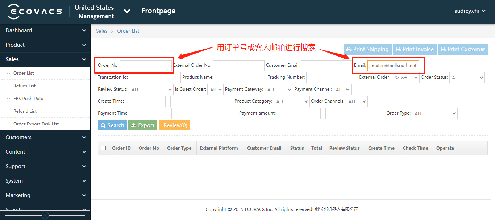
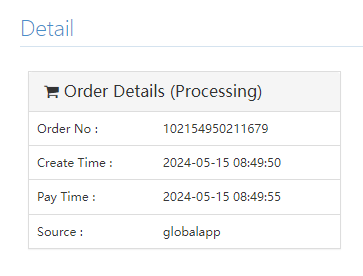
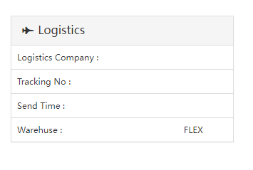
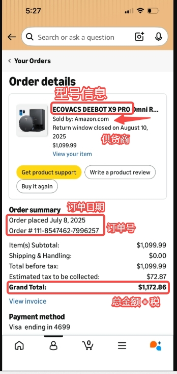
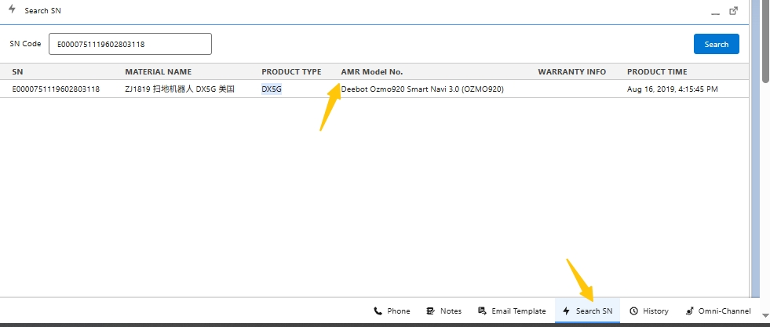
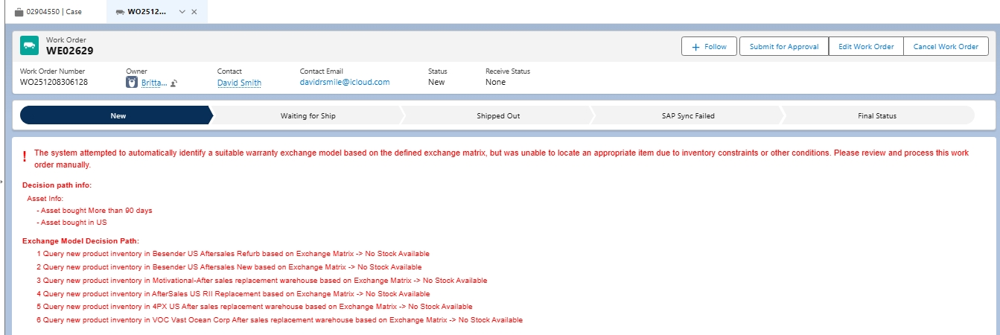
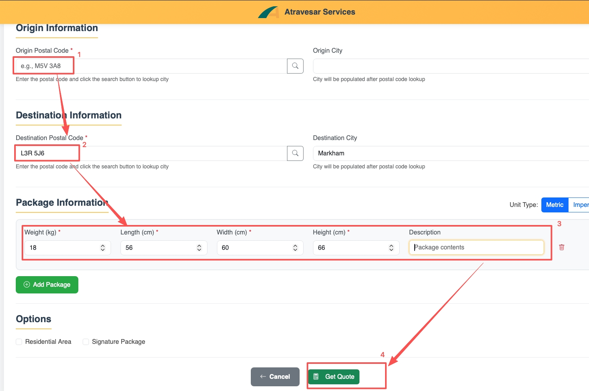

# 北美流程整合（V260617 质保流程重大更新）

# 一、售前/销售/合作相关流程

### 1\. DTC（Direct\-to\-Customer\) 常用相关政策/内容及提醒

1. 关于官网**订单状态**如何进行确认的问题：

**（1）取消订单/Order Cancellation: **DTC团队会对相关订单进行处理，当对应的订单被正式取消和退款后，用户端可以看到订单状态变为“Cancelled"。

**（2）修改地址/Address Modification：**

- 官网订单处理系统在处理订单前（俗称**推单前**），DTC团队可以在对应的内部系统进行地址的修改，地址修改成功后，用户端**可以看到**地址更改为新地址/正确的地址。

- 如对应的订单**已完成推单**，需要DTC团队进行修改，哪怕是地址修改成功后，用户端也**无法看到**地址被更改为新地址/正确的地址。

*这两类情况从用户提出需求到问题解决都需要一定时间，因此目前没有更直接的方法让一线客服明确查看处理状态。建议将相关问题转交至 DTC 团队进行核实和跟进。如遇紧急情况，可直接联系 DTC 的 Agent Maggie 或 Audrey 以便及时处理。*

2. DTC官网支持30天内退/换货，所有退/换日期都是从包裹寄到用户地址开始计算。如遇到官网**退货**退款的用户，请务必务必努力尝试排障 \- **排障****无法****解决问题，再升级到**** ****AMR DTC Group**

3. 所有在30天内DTC购买的要**退/换**需要直接转给DTC处理，**不要**走售后的质保

4. DTC换机流程提醒：所有走DTC流程的换机都需要用户把**原****机器**寄回来，**送到我们仓库后**DTC才会发新机给用户，请知悉，**千万****不要****和用户说我们会申请优先换机**

### 2\. 促销咨询（Promotion Inquiry）

#### 2\.1 处理流程（Handling Flow）

Currently, the [**maximum discount**](https://lmgx8md8u1.feishu.cn/docx/QgAbdVEWnoKWEkxxRrIcG590nnb#doxcn3kfUoX8Wt6IJLvGq44qgSd)** **available for machine purchases on the official US or Canadian** Ecovacs Official Store** is 5% off, while accessory purchases are eligible for 10% off\. For customers seeking higher discounts or special offers \(such as veterans’ discounts\), please escalate the inquiry to DTC \(Direct\-to\-Customer, Pre\-sales\) for further assistance\.

目前，在**美国或加拿大官方网站**上，**整机购买**可享受的最大优惠券折扣为 **5%**，而**配件购买**可享受 **10%** 折扣。若客户希望获得更高折扣或特殊优惠（例如退伍军人优惠等），请将其咨询升级至 **DTC（Direct\-to\-Customer, 即官网销售团队）** 以获得进一步协助。

**积分使用：**购买机器积分最多可以用**总订单金额的30%**，购买**耗材**最多可以用**10%**

**新注册会员****积分奖励：****美国****新用户奖励****3000积分****；****加拿大：5000**积分

**新注册会员****额外****优惠券奖赏****：赠送**1张**20% 耗材优惠券**，优惠券有效期：**领取后30天内有效**（最终以实际活动规则为基准）**。**

**积分规则详情**：

- **美国**官网积分政策：https://www\.ecovacs\.com/us/ecovacs\-club/ecovacs\-points

- **加拿大**官网积分政策: https://www\.ecovacs\.com/ca/ecovacs\-club/ecovacs\-points

#### 2\.2 最新优惠券（代金券Voucher）代码

Canada \& USA（2026年1月11日后生效）

**购买机器 \(大货\)：CCRB5**

购入机器可用 5% 折扣，可与推广、会员等其他普通折扣优惠码 \(Coupon）叠加使用；不可与售后客服端同类型的代金券叠加 （即 Voucher \+ Coupon 的形式可以，但 CCRB5 \+ CCRB5 不可以\)

**购买耗材：CCACE10**

购入耗材可用 10% 折扣，不与其他券码叠加使用

#### 2\.3 DTC 官网以旧换新 Upgrade Program

[**US Upgrade Program**](https://www.ecovacs.com/us/upgrade)
[**CA Upgrade Program**](https://www.ecovacs.com/ca/upgrade)

如果用户需要了解Upgrade Program的具体规则，可指引如下：

第一步：访问官网 [US Webstore](https://www.ecovacs.com/us) 或 [CA Webstore](https://www.ecovacs.com/ca)

第二步：点击网站上方导航栏的“**Upgrade Program**” 

第三步：在Upgrade Program界面下滑，找到以下截图界面中的“**How it works**"，点击右上角的"**Rules**"便可了解具体规则。

###### **2\.3\.1 了解Upgrade Program相关咨询**

若客户需要了解更多Upgrade Program的相关咨询，请参考以下模板。
**使用模板：** US \& CA Upgrade Program/Loyal Customer Buy New

###### **2\.3\.2 Upgrade Program**** ****两种模式**

**模式一：无需寄回旧机**

客户使用旧机 Serial Number 码在官网兑换 Voucher 进行购买，客户无需寄回旧机。

**模式二：需寄回旧机**

客户使用旧机 Serial Number 码兑换Voucher进行购买后，**需将旧机寄回**，旧机退回后，Voucher兑换的Upgrade Credit才会退还给客户。

**美国官网Trade In以旧换新，于2026年7月7日正式上线：**https://www\.ecovacs\.com/us/upgrade

**客户操作流程：**

1. 客户下单后，可在**订单确认信**中查看旧机寄回流程。

2. **下单后的****1\-2个工作日内**，BSD系统会向客户发送**Return Label/回邮标签**及详细指引邮件。

**处理指引：**

- 客户会在**订单确认信**中定位到寄回指引，说明如何寄回旧机。

- 若客户对指引内容不清楚或对寄回流程有疑问，请先向当值的** ****Tier 2**** / ****Team Leader **进一步确认。如有必要，**Tier 2 / Team Leader** 会进一步升级至 **DTC 持续跟进**。

- 若**回邮单地址需要更新**或**未收到回邮单**，CC Agent 不可直接操作，请在回复用户后，直接升级至DTC团队处理，并在Internal Post中列明用户需求、对应订单号等信息。

- 若客户已退回原机，但**未收到Upgrade Credit的****差价退还**，请在回复用户后，直接升级至**DTC团队处理**，并在Internal Post中列明用户需求、对应订单号等信息**。**

### 3\. 物流相关处理流程 （Logistics\-related Processes）

#### 3\.1 物流状态咨询（Shipping Status Inquiry）

##### 3\.1\.1 常规执行流程（Handling Flow）

##### 3\.1\.2 操作步骤（Operation Steps）

**Action 1: Collect Relevant Information**

- For official website orders, collect the **order number** or **email address** for placing the order\.

- For warranty replacement orders, collect the **Salesforce** **case number**\.

**Action 2: Check Shipping Information for Webstore Orders**** **

1. Log in to [Ecovacs Admin Portal](https://eco-intl-sso.ecovacs.com/login?service=https%3A%2F%2Fadmin-us.ecovacs.com%2Fsite%2Flogin)\. 

2. Search using the** order number** or the **email** used to place the order\.

**Script: Suggest the customer contact the original seller/shopping platform for details**

Dear Customer,

Thank you for your inquiry\. Please note that we can only track orders made through our official website\. For orders placed through other platforms, we suggest reaching out directly to the original seller to inquire about the order status\.

#### 3\.2\. 物流地址变更（Shipping Address Modification） 

##### 3\.2\.1 常规执行流程（Handling Flow）

##### 3\.2\.2 常用情景和话术

**Script 2: Informing the customer that the package has been delivered to the original address and personal pick\-up is suggested in this case\.**

Please kindly note that your package has already been delivered to the original address, and therefore, we are unable to reroute the package with UPS at this moment\. In this case, it's recommended to pick up the package in person or contact UPS directly for any further assistance\.

#### 3\.3\. 包裹损坏（Damaged Package）

##### 2\.3\.1 常规执行流程（Handling Flow）

### 4\. 保价流程（Price Match）

#### 4\.1 常规执行流程（Handling Flow）

#### 4\.2 操作步骤（Operation Steps）

##### 4\.2\.1 DTC 平台保价

如果顾客在官网购买30天内发现订单更便宜需要退差价，请升级到**DTC团队**安排退差价

**升级的人员或者部门：**

官网的订单 \- Case Owner \> Queues \> AMR DTC Group

官网保价政策：[Price Match Guarantee（US）](https://help.ecovacs.com/us/support/price-match-guarantee-policy)；[Price Match Guarantee（CA）](https://help.ecovacs.com/ca/support/price-match-guarantee-policy)

##### 4\.2\.2 DTC 订单跨平台保价

①DTC订单支持跨平台价保。**前提必须是DTC下的单**，发现其他平台价格更便宜，在30天内可以凭截图或链接升级DTC做价保——直接转给DTC处理; 

②如果是在其他平台下的单，发现我们官网价格更便宜想要价保，**直接建议用户去我们官网下单即可**

（此类情况，客户在其他平台下的单，DTC根本没收到客户的钱是不可能直接给客户退差价）；

##### 4\.2\.3 Best Buy平台保价规则——科沃斯自营店铺

1、适用范围：目前BestBuy可对**科沃斯自营店铺产品**提供价保服务（注意：第三方卖家在BestBuy上销售商品不适用此价保流程）；非科沃斯自营，则建议用户联系平台客服，因店铺非科沃斯直接运营/管理。

2、适用情况：BestBuy客户反馈，其购买的产品对比不同平台（科沃斯自营官方店铺）之间存在价格差异或者在BestBuy平台（科沃斯自营官方店铺）购买后产品降价，要求退差价；

3、客服具体操作：
（1）根据以下条件判断是否符合此保价流程（条件①②③均符合，则符合此保价流程）

①向客户索要订单号，订单号为**BBY03**开头，就是科沃斯自营；

②购买时间为**30天内**；

③客户比价的平台和店铺为**科沃斯自营官方店铺**
注意：确认为下表中的平台和店铺，且判断符合保价流程可以直接答应用户再转邮件；其余平台不确定的，可以先跟Tier 2/Team Leader确认；

##### 4\.2\.4 Amazon US/Amazon Canada平台价保规则

1. 适用范围：目前由于维评的特殊性**可对Amazon US/Amazon Canada**的订单提供价保服务（注意：第三方卖家在Amazon上销售产品不适用此价保流程）

2. 适用情况：**Amazon US/Amazon Canada** 客户反馈，其购买的产品对比不同平台（科沃斯自营官方店铺）之间存在价格差异或者在Amazon平台（科沃斯自营官方店铺）购买后产品降价，要求退差价；

|平台|店铺/Seller||
|---|---|---|
|Amazon|Amazon\.com|Ships from Amazon\.com   Sold by Amazon\.com|
|Target|Ecovacs Robotics Inc|Sold \& shipped by Ecovacs Robotics Inc\.|
|BestBuy|ECOVACS Robotics|Sold \& shipped by ECOVACS Robotics|
|Walmart|Ecovacs Robotics|Sold and shipped by Ecovacs Robotics|

（2）工单升级给Team Leader/Tier 2

### 5\. 退货/退款政策和流程（Return and Refund）

#### 5\.1 常规执行流程（Handling Flow）

#### 5\.2 操作步骤（Operation Steps）

##### 5\.2\.1 确认购买渠道和退货原因

注意：①与客户讨论退货流程前，请务必确认购买渠道！②所有取消和退款的订单均需要和客人确认取消或退款原因。

\>我们只接受官网**30天内（从包裹送到顾客的日期开始计算）**订单退货请求

官网退换货政策：[RETURNS AND EXCHANGES（US）](https://help.ecovacs.com/us/support/returns-warranties)；[RETURNS AND EXCHANGES（CA）](https://help.ecovacs.com/ca/support/returns-warranties)

\>其他平台购买的产品，提供产品故障排障，并为官方渠道购买产品提供售后流程，如客户要求退货退款，请引导客人至对应平台办理。

\>如用户提出退货的原因是由于官网价格变动，或发现其他平台售价低于官网价格所导致的退货需求，可参考[Price Match（保价流程）](https://lmgx8md8u1.feishu.cn/docx/QgAbdVEWnoKWEkxxRrIcG590nnb#doxcnw4TD0EQJOIuCSYgYlUQyQe) 进行处理。

##### 5\.2\.1\.1 DTC订单取消流程

（1）若客人想取消订单，需要**询问退货的理由，**然后拿订单或购买邮箱到查询订单网站进行查询是否有货运信息，如果没有tracking number，用以下邮件模板把工单转到AMR DTC Group名下让DTC取消订单

（2）如果订单如图所示显示在处理中且下面**没有tracking number**，即可使用cancel order request 邮件模板升级给DTC

（3）若订单已经发出并寄到了客户的地址，需要**询问退货的理由**，然后用下面的邮件模板升级到DTC办理退货

注意：

①如客户因机器故障或者表现要求退货，**请先****提供排障**；其他原因无需提供排障；

②退货是否涉及运费扣除，**最终决定权在DTC**，**客服****请勿就此问题设定预期**

官网的订单升级 \- Case Owner \> Queues \> AMR DTC Group

##### 5\.2\.1\.2 DTC订单换货要求

若客人是在30天内不是很满意机器的表现或机器出现故障，想要换一台相同型号的机器，先提供排障，排障后不能解决，使用下面的邮件模板升级给DTC。

#### 5\.3 亚马逊特殊退款执行操作流程

注意：①与客户讨论退货流程前，请务必确认购买渠道！②所有取消和退款的订单均需要和客人确认取消或退款原因。

\>我们只接受亚马逊**官方授权渠道****30天内（从包裹送到顾客的日期开始计算）**订单退货请求

\>提供产品故障排障，并[以“主流销售平台”和“非主流销售平台”为依据判断后续质保流程](https://lmgx8md8u1.feishu.cn/wiki/VeKqwnu57iEJimkLYX2caEqoneh?contentTheme=DARK&last_doc_message_id=7668513452285332762&preview_comment_id=7668513563257867564&sourceType=feed&theme=light#share-J537dVAmRontxqxopujc3YGZn7c)，如客户坚持要求退货退款，请咨询**当值****Tier 2/Team Leader**

\>如用户提出退货的原因是由于官方授权渠道价格变动，或发现其他平台售价，或官网价格低于亚马逊授权渠道导致的退货需求，可参考[Price Match（保价流程）](https://lmgx8md8u1.feishu.cn/docx/QgAbdVEWnoKWEkxxRrIcG590nnb#doxcnw4TD0EQJOIuCSYgYlUQyQe) 进行处理。

### 6\. DTC服务配件补发流程

#### 6\.1 常规执行流程（Handling Flow）

对于**官网 30 天内****下的订单**，如果用户需要补发**服务配件**（如滚刷盖板、水箱、抹布支架等），请按以下流程处理：

**需跟进并为用户创建 ****Work Order \(****WO****\)**，以补发相应配件。**在创建 WO 前，务必先在 BSD 系统确认该配件库存情况。**

- 若 **有库存**：正常创建 WO 并安排发货。

- 若 **无库存**：将案件转交至 **DTC 团队** 处理退货/换货流程。

### 7\. 商务合作处理流程（Business Cooperation Handling Flow）

#### 7\.1 常规执行流程（Handling Flow）

#### 7\.2 操作步骤（Operation Steps）

注意：各类合作咨询或商务问询，均由**Tier 2/****Team Leader**处理，一线Agent识别出该类咨询后，升级Tier 2/Team Leader即可。

# 二、售后处理流程

### 故障设备常规处理流程（Faulty Devices Handling Process）

#### 1\.1 北美地区保修政策

##### 1\.1\.1（用户端\) 北美官方品牌保修政策

[官网保修政策原文（US）](https://help.ecovacs.com/us/support/warranty)

##### 1\.1\.2（客服端\) 北美新质保政策/保修政策验证流程（2026年6月15日生效\)

###### 1\.1\.2\.1 以“主流销售平台”和“非主流销售平台”判断后续验证保修的流程

**自2026年6月15日开始**，取消以“授权渠道”与“非授权渠道”来判断用户的机器是否可以享受品牌质保服务；取而代之，使用**“****主流销售平台****”**与**“****非主流销售平台****”**为依据，来进一步判断机器的**质保开始时间/Warranty Start Date**是以购买日期为准，还是以Serial Number（SN）配网激活日期为准。

**质保验证方式：**

**主流销售平台**

- 以购买凭证（订单、发票等）作为质保依据。

- 质保起始日期（Warranty Start Date\) = **购买日期**** **\(Purchase Date）

**非主流销售平台：** 

- 质保起始日期 = **SN 查询到的激活日期**。

- 通过 **SN（序列号）** 查询设备激活日期。

**特殊验证：**

适用于**非主流销售平台购买\(无购买凭证/或翻新机\)**，且**无法通过 SN 查询到设备激活信息**的情况。

**验证方式：** 以机身底部标识的生产日期为基准。

- 质保起始日期 = **生产日期\(如下图\)**** \+ 4个月**

###### 1\.1\.2\.1\.1 主流销售平台

**机器的质保开始日期/Warranty Start Date，等于购买凭证上的购买日期/Purchase Date \(Order Date）。**

- ***主流******销售******平台******，包括******：***

    - *Amazon CA *

    - *Amazon US*

    - *Best**B**uy CA Seller*

    - *Best**B**uy US Seller*

    - *Costco CA*

    - *Costco US*

    - *eBay US Seller*

    - *Target US Seller*

    - *Walmart US Seller*

    - *US DTC*

    - *CA DTC*

###### 1\.1\.2\.1\.1\.1** 亚马逊特殊售后处理**

**责任范围划分**

- **自购买之日起 ****30 天内**：若**用户处于 Amazon 30 天退换货期限内**，一线客服在完成排障并确认无法解决问题后，**在****用户需要快速解决问题时**，可告知用户，**可选择**联系 Amazon 办理退换货、退款或其他相关售后服务，或选择由我方提供质保服务，**由用户自行决定处理方式**。

**处理原则**

- 对于 **Dead on Arrival \(DOA\)** 或购买后 **30 天内** 的售后问题，一线客服在完成排障且确认无法解决后，若用户自行提及在30天的亚马逊退还期内，且表示急迫需要快速的解决方案，可委婉建议用户联系 **Amazon** 申请退换货、退款或价保。

    - 可向用户说明，通过 Amazon 完成换货后，产品质保期将重新计算。

    - 沟通时应**保持中立**，不贬低或比较双方售后流程，**避免给用户造成我方推诿责任的印象**。

**特殊情况**

- 若用户此前**已联系过 Amazon**，但被引导至我方处理，我方应直接提供售后兜底方案，**为避免差评，请勿再次引导用户联系 Amazon**。

###### 1\.1\.2\.1\.1\.2 美国亚马逊购买至南美国家

- 若用户需要质保服务，**优先引导用户联系 Amazon **售后。

- 若用户无法通过亚马逊完成售后，或被亚马逊反推至我方，可**升级至 Tier 2/Team Lead 向HQ申请特殊退款****——请勿擅自承诺用户。**

- 若仅需更换**备件或耗材**即可解决问题，可升级至 **Tier 3 \(Elma\)****评估**是否可**寄送备件至用户所在地。**

- 若故障必须经过拆机维修且***工装标定***，应可**升级至 Tier 2/Team Lead 向HQ申请特殊退款****——请勿擅自承诺用户。**

    *PS：工装标定定义如下*

    *当更换以下配件或涉及相关拆装操作时，需进行对应的****工装标定/Calibration Tooling****：*

    *更换主板；*

    *拆装或更换各类传感器，包括但不限于：*

    *结构光传感器*

    *AI 摄像头*

    *沿边/沿面传感器*

    *单线结构光避障传感器*

    *激光传感器（线束激光传感器）等 *

    *更换可能导致传感器安装角度或位置发生变化的配件，例如撞板模组等。 *

    *为确保传感器定位准确及设备正常运行，维修完成后需执行相应的工装标定。*

###### 1\.1\.2\.1\.2 非主流销售平台

**机器的质保开始日期/Warranty Start Date，等于机器Serial Number （SN）****的****配网****激活时间**** ****（不再区分型号，不再区分是否授权渠道）。**

**Amazon Resale**属于**非主流销售平台****，**请使用机器**SN的配网激活时间**作为该机器的质保开始日期;

用户表示机器为**礼物或他人赠与****，**请使用机器**SN的配网激活**时间作为该机器的质保开始日期;

- 用户提供了机器的SN后，先通过Salesforce系统**全局搜索****/Search All**确认该SN是否有换机的记录，**避免非必要升级或错误承诺质保**

- 如确认该SN存在同一用户的换机记录（有关联的换机WO, SN状态为Destroyed），则以重复质保（Duplicate Claim）为由拒绝质保

- 如核实不存在上述无质保效益的情况，则报备至当值的**Tier 2/Team Leader**，将内部升级至HQ以验证该**机器SN的配网激活时间**（内部信息，请勿向用户提供\)

###### 1\.1\.2\.1\.3 各品类科沃斯机器对应的质保时长（Service Terms）\- Effective 2026\-8\-12 GMT\+8

在确定了机器的**质保开始日期**是与“**购买日期**”还是与“**SN配网激活日期**”对等后，参照以下质保时长表进行处理：

|**产品类型**|**保修期**|**是否享受一年礼遇**|
|---|---|---|
|全线地宝|1 年|**是**|
|全线窗宝|1 年|**是**|
|2026 A\&O 割草机|1 年|**是**|
|Amazon Resale 机器|1 年|**否**|
|WOOT/WOOT LLC 等渠道购买的低价机器|1 年|**否**|
|2025 A\&O 割草机|2 年|**否**|
|割草机 GX\-600|整机2年，电池1年|**否**|
|泳池机器人|1 年|**否**|
|亲宝|1 年|**否**|

***最新 BER/EOL 地宝型号，包括***

*WINBOT X*

*DM80 Pro/DM81 Pro*

*DN79/DN79S/DN79SE/DN79W*

*D500/D600/D601/D661/D665/D710/D711/D711S/D901/D907*

*OZMOU2/OZMOU2 Pro/OZMOU2SE*

*OZMO610/OZMO920/OZMO930/OZMO937/OZMO950/OZMO960*

*OZMON7/OZMON8/OZMON8\+/OZMON8P/OZMON8P\+/OZMON8W\+/OZN8PW\+*

*OZMOT5/OZMOT8/OZMOT8\+/OZT8AIVI/OZT8AI\+*

***2025 A\&O系列割草机，包括：***

*GOAT A3000LiDAR*

*GOAT A2500RTK*

*GOAT O1000RTK*

***2026 A\&O系列割草机，包括：***

*GOAT A3000LiDAR PRO*

*A2000 LiDAR PRO*

*O1000 LiDAR PRO*

*O1000 RTK Care Kit*

##### 1\.1\.3 保修服务后保修期计算

（1）保修更换/修理并**不会**重新开始保修期，更换产品仅继承原保修的剩余时间或90天（以较长者为准）；

（2）任何情形的一次性例外维修/更换服务，均不会提供额外的保修期，及提供维修后的**90天**保修服务。

###### 1\.1\.2\.1\.4** 购买日期/SN配网激活日期****大于****24个月（购买超过2年\)**

按“过保”处理，参考“[**购买日期大于24个月（购买超过2年）**](https://lmgx8md8u1.feishu.cn/wiki/VeKqwnu57iEJimkLYX2caEqoneh?renamingWikiNode=false#share-JaxzdpeEdoT9K8xbo7lc5tZxn1d)“进行婉拒，并推荐保外服务中心。

###### 1\.1\.2\.2 官方翻新机

**一般情况：官方认证的**翻新机器我们提供**90天的保修**

（1）客户通过售后渠道获得的官方翻新机

（2）Ebay的Yeedi商店售出的官方翻新机

注意：任何不确定是否官方认证可以跟Tier2/Team Leader/AMR确认

扩展信息： [Authorized Factory\-Renewed Products 描述](https://lmgx8md8u1.feishu.cn/wiki/R5q2wNMVDip8ltkkT8Ocau1qnNd#share-GiicdMzvAoTdJUxyRdHcAt4bnnV)

###### 1\.1\.2\.3 维修中心维修后的机器保修

经过维修中心换机的机器是有90天的保修期（自从**维修中心寄出日**开始计算），如果在此期间用户联系我们，我们是可以提供保修的。

注意：换机后90天内，只要客户反映机器有问题的，都可以享受保修，不要求针对同一故障。

###### 1\.1\.2\.4 人为拆机或损坏的情况

人为拆机或损坏的情况均不提供保修服务，详细条款见[www\.ecovacs\.com/us/support/warranty](http://www.ecovacs.com/us/support/warranty)

###### 1\.1\.2\.5 测试机的保修

测试机，即Ecovacs给个人发放的测试样机。请使用下面邮件模板来收集信息，每个测试机的warranty都不一样，以**具体协议**为准。

#### 1\.2 执行步骤（Operation Steps）

##### **1\.2\.1 验证机器是否符合保修 （Verify product warranty）**

依照[**（客服端\) 北美新质保政策/保修政策验证流程（2026年6月15日生效\)**](https://lmgx8md8u1.feishu.cn/wiki/VeKqwnu57iEJimkLYX2caEqoneh?renamingWikiNode=false#share-Q580dttVHo9WmAxZA1Lc7AB0n3d)** **执行

###### 1\.2\.1\.1  用 Collect Info 邮件模板收集客人机器的SN等信息。

###### 1\.2\.1\.2  判断机器保修状态

依照[**各品类科沃斯机器对应的质保时长（Service Terms）**](https://lmgx8md8u1.feishu.cn/wiki/VeKqwnu57iEJimkLYX2caEqoneh?renamingWikiNode=false#share-PZqDdwG4boOj21xLv8WcF3WAnYc)执行；

###### 1\.3\.1\.3  亚马逊购买凭证判断

**亚马逊购买凭证**不论是手机版截图还是网页版截图，**均可用于验证**。只需确保购买凭证包含以下5大关键信息即可：

**手机版：**

**网页版：**

#### 1\.4 特殊售后流程

**参考**[**维修中心切换过渡时期特殊处理流程**](https://lmgx8md8u1.feishu.cn/docx/QgAbdVEWnoKWEkxxRrIcG590nnb#doxcnV3HkiX1Y178T4DAsW8crOg)

### 2\. 维修中心切换过渡时期特殊处理流程（Consultation on Repair\-related Scenarios:）

#### 2\.1 流程说明

自2025年4月1日起，我们将切换新的维修中心。在过渡期间，我们**对于所有保内的机器一律提供换机，不提供维修****（****以换代修****）****。**

#### 2\.2 操作步骤（Operation Steps）

1. 收集用户信息及**设备****Serial Number****;**
*设备**Serial Number**必须要用** ****Search ******SN**** **功能验证机器是否为用户购买的机器，若不一样要和用户再次确认*

2. 点击**Create AMR Work Order**去创建保修工单，取决于用户机型是否需要寄回发送不同邮件模板告知用户

3. 若不缺货，点击'AMR dispatch‘帮用户保修即可；若缺货，系统会以**红字**显示，此时，我们需要用Post把case升级到**Tier 3 \(Elma\)**** **名下让他安排换机

    - 仓库一旦发货，WO的状态会更新为'**Shipped out**‘，同时WO处的’**Dispatch Label Tracking No**'会更新

4. 向用户发送邮件，通知新机的**Tracking\#**和换机的机型（由于库存原因，换机机型可能会和原始机型不一致，**务必要告知用户换机机型**，万一出现了**机型降级**的情况一下要及时向Tier 2/Team Leader反馈）。

***重要提醒（内部信息，请勿对外跟用户透露\)：****在质保换机流程中，系统将根据用户的****原机器购买日期/Date of Purchase/Warranty Start Date****自动匹配全新机或翻新机——在成功创建Work Order \(WO\)后，****在点击AMR Dispatch发货前****，****需要进一步******检查WO中所填写联系人信息、地址、所选AMR Model No\.、机器的Serial Number等是否都准确无误。***

***系统替换机匹配逻辑（内部信息，请勿告知用户\)——最新Exchange Matrix已上线，正常情况下不需要Tier 3手动调整机型，除非出现"缺货提示“；***[***出现缺货，请参考"升级至Tier 3"相关流程要求进行必要的升级***](https://lmgx8md8u1.feishu.cn/wiki/VeKqwnu57iEJimkLYX2caEqoneh?renamingWikiNode=false#share-OrxPdNqpUoPzMSxcggUcj9J0n1f)***。***

- *Purchase Date \<=3 Months, 系统将优先匹配全新机——如果出现系统匹配机型错误（即没有安排全新机\)，升级Tier 3进行调整；*

- *3 months \< Purchase Date ≤ 6 months，系统优先匹配A类翻新机, A类翻新机缺货，将自动匹配全新机——如果系统匹配机型错误（即低于A类翻新机），升级Tier 3进行调整；*

- *6 months \< Purchase Date ≤ 12 months，系统优先匹配机型的优先级为: B类翻新机 \> A类翻新机 \> 全新机；*

- *12 months \< Purchase Date ≤ 24 months，系统优先匹配机型的优先级为: C类翻新机 \> B类翻新机 \> A类翻新机 \> 全新机；*

#### 2\.3 原设备寄回规则 

##### 2\.3\.1 生效日期及适用情形

从**202****6****年6月****9****日**起，以下**适用机型**在购买时间**不超过（小于等于）****6****个月**的情况下，用户必须将**原设备寄回**：

**适用机型**：DEEBOT X5、X8、X9、X11、T30、T30C、T50、T50 Max, T50S、T80、T80S、T90/X9S、X11S、X12; GOAT O1000RTK、A2500RTK、A3000LiDAR、GOAT O1000RTK Care Kit、O1000LiDAR PRO、A2000LiDAR PRO、A3000LiDAR PRO、泳池机器人UltraMarine P1

对于**其他型号（包括****所有****窗宝****，****亲宝LilMilo****，及GOAT GX600****）**，仍按原有流程处理，用户**无需寄回****原来的****设备**。

##### 2\.3\.2 执行步骤

\>Salesforce系统目前WO会对Serial Number查重，若该Serial Number已经有换机的WO（进行中或已关闭），则无法创建新的WO，系统会有提醒；

\>原Zendesk系统的部分工单，仍记录在[失效SN登记表](https://lmgx8md8u1.feishu.cn/sheets/Cv6Us9tH9ht0QKtJajgcanmenNf?from=from_copylink)中的“**保修服务失效SN**”中，agent可通过此表查询客户之前是否在切换系统前进行过换机。

2025/12/16起，[失效SN登记表](https://lmgx8md8u1.feishu.cn/sheets/Cv6Us9tH9ht0QKtJajgcanmenNf?from=from_copylink)仅仅作为查询用途，**无需再进行手动新增**

###### 2\.3\.2\.1特殊情形处理

如遇到以下情况：

例，如果张三旧机Serial Number用户**已经退回**，被**Besender翻新**给了李四。李四翻新机质保期内需要再次换机，需要在原Asset更新contact给李四，并更新机器新的质保开始和结束日期——**目前这部分，需要操作时 *****请联系Tier 2/******Team Leader****** 进一步核实，由Tier 2/******Team Leader****** ******代为操作，直至另行通知******。***

准确地说，在以上例子中：

1. 如果给张三创建了一个WorkOrder，其关联Asset的Serial Number为"E123"。

2. 如果尝试给李四创建一个Serial Number也为"E123"的WorkOrder，系统会**阻断**WorkOrder的创建, **报出错误提示：****Serial Number****重复/****Serial Number****已存在**。

##### **2\.3\.3 注意事项**：

- 回邮标签有效期：

|**承运商**|**标签起算期**|**标签有效期**|**使用地区**|
|---|---|---|---|
|FedEx |自用户**打印之日**起算|14天|美国|
|UPS|自创建日起算|90天|美国（基本弃用）|
|USPS|自购买/创建日起算|28天|部分偏远地区|
|Purolator |邮件中的下载链接 **5 天失效** |下载并打印后无系统有效期限制**；**对外统一口径：**有效期 30 天**|加拿大 |

- 如果用户在**回邮标签失效前**因特殊原因未能寄出**原机器**，但之后再次联络我们，请通知Tier 2/Team Leader，让他们为用户创建新的shipping label。

- 若用户要求上门取件服务，确认用户方便的时间后，把case升级给Tier 2/Team Leader做预约处理

- 识别货运商名称

旧机**回邮标签/Return Label**目前为FedEx （美国用户）或Purolator（加拿大用户）两种，常见tracking\#示例 如下：

**FedEx**: 885XXXXX7493

**Purolator**: EWVXXXXXXX70 \(虽然Besender平台依旧显示“货运商/Carrier"为UPS\)

相关Email Template使用时请对应修改，**删除**不适合情景的Carrier名称。

**Macro 5 \- Inform Label Status**

**Macro 6 \- Inform Replacement's Tracking \& Remind to Ship Original Machine**

**完整的流程及对应****邮件模板****参考此文档: **[Warranty Replacement Process](https://lmgx8md8u1.feishu.cn/docx/TQ35dIWGpoz8eMxP9D0cgAJknwf?from=from_copylink)
*附**SF **邮件模板**路径*

#### 2\.4 特殊岛屿区域处理流程

目前售后仓库无法发机器到特殊岛屿区域（如Hawaii和Puerto Rico），如果该区域用户进线寻求保修，正常收集完信息后（POP，Serial Number号，视频缺一不可），用**以下话术（截图所示）**收集用户资料，用户回复完之后，回复升级专用回复模板，**必须**将工单**升级至Tier 3 \(Elma\) 处****确认退款还是换机：**

**若退款，需升级给****Tier 2****/****Team Leader****进行后续跟进。**

- *（直至另行通知\) 后续遇到 ****PR\-Guaynabo（邮编 00968、00969）**** 的订单时，****无需升级至 Tier 3 确认换机或退款方案，请直接选择退款选项。***
*目前发现该区域的换机物流成本较高，相关费用约为 ****$700–$800/台****，****无需向客户透露此信息****。*
*其他 Puerto Rico 地区目前暂未发现类似情况，****按照正常流程处理即可****。*

**若换货，请按照****Tier 3****指引处理下一步。**

特殊岛屿区域包括：

- Hawaii

- Alaska

- Puerto Rico

- Guam

- U\.S\. Virgin Islands

- Northern Mariana Islands

- American Samoa

### **3\. 产品****过保**** ****（****1年品牌质保已过****）****处理流程（****One\-time**** Courtesy ****Service ****Process）**

（此流程除了特殊提供延保的GOAT和地宝外其他机型都适用）
*注**1**：Woot/other discount retailers 提供 12 个月的保修，不提供延长保修\.（2025年9月4日更新）*
*（如无法确定other discount retailers，请升级**Team Leader**/**Tier 2**）*

*注2：如果用户在特殊岛屿地区购买的亚马逊订单，则无法享受特殊延长保修服务*

#### 3\.1 常规处理流程（Handling Flow）

#### 3\.2 执行步骤（Operation Steps）

##### 3\.2\.1 购买日期小于24个月

只要用户购买日期在**两年以内**，我们都可以提供保修，但必须强调：

- ECOVACS **官方保修为****1****年****/12个月**

- 这次是因为对方是忠实客户，**破例提供一次性的免费特殊保修服务**** **\(即内部提供的1年礼遇服务，俗称提供One\-time Courtesy Service）

    - **邮件模板：**Offer OOW Courtesy Service \(No BSD/IFR\<24 months\)

- 创建完WO之后请用邮件模板 **OOW ****Courtesy ****\- No Need to Return Original Machine**** **告知用户保修流程（请**不要使用**普通的**Macro 2 \- No Need to Return Original Machine**的邮件模板）

##### **3\.2\.2 购买日期****大于****24个月（购买超过2年\)**

###### **美国 \- BESENDER**

自购买日期起，已经**超过2年**的机器，不再享受1年品牌质保或OOW One\-time Courtesy Service, 指引用户联系 **BESENDER **进行**保外服务**或**购买维修配件**的咨询

***指引用户联系******BESENDER******后，请选定Case Tag \> ******US OOW Case******进行标记***

- **维修****：**\(购买超2年\) US OOW **BESENDER** 邮件模板

- **购买****耗材类****配件****：**\(购买超2年\) US OOW **BESENDER **\- **Buy Parts****/Accessories**** **邮件模板

###### 加拿大 \- ATRAVESAR SERVICES——Effective on 2026\-8\-11 21:00 GMT\+8

自购买日期起，已经超过2年的机器，不再享受1年品牌质保或OOW One\-time Courtesy Service, 提供初步的报价邮件，用户确认维修，转移case给 **ATRAVESAR SERVICES **进行保外服务咨询。

补充说明：

A\. 关于报价：

保外维修初步报价包含4部分：①往返运费 ②检测费 CAD40 ③维修费（检测费计入）④备件费

①运费：需要对方提供postal code，提供后可以客服可使用 [https://fulfillapi\.atravesar\.ca/api/shipment/quotation](https://fulfillapi.atravesar.ca/api/shipment/quotation)查**往返**预估运费（已提2需求: a\. 注意关注报价币种，改为CAD，减少单位换算工作, USD\*1\.35；b\. 用户→RC→用户的往返费加和计算出来显示在操作界面上）

注：Destination Information处的Postal Code处，填写加拿大维修中心的Postal Code（即L3R 5J6）

②检测费 CAD40（维修后，检测费将计为维修费中，需要先付）

③Options：维修完成后，RC→用户时，需要点选*Residential Area*；如用户要求签名收货（此选项收费更高），点选*Signature Package*

B\. 关于Case更新要求
1、用户确认要保外维修后，必须收集的信息如下：
①AMR Model No\. ②SN  ③购买日期  ④Request Description ⑤ Case tag选择***CA OOW Case******（注意：仅用户确认送修才添加此tag）***

2、用户确认要付费维修，则回复模板2，抄送给 ecovacs\.service@atravesar\.ca，便于RC实时了解沟通详情

**C\. 邮件模板1：**\(购买超2年\) CA OOW \- Atravesar Services

Thank you for contacting ECOVACS\. We've taken a close look at your purchase record, and we're sorry to let you know that your machine is now past the one\-year warranty period, so it's no longer covered under our standard warranty or the one\-time courtesy service\.

That said, we do want to help you get it fixed\. For machines out of warranty in Canada, we work with Atravesar Services, a trusted ECOVACS partner service center, who can professionally diagnose and repair your unit\.

To help you decide, here's what an out\-of\-warranty repair involves:
1\. Shipping fee — this covers the total round\-trip shipping cost for sending the machine to the repair center and having it shipped back to you, typically around CAD 60–100 depending on your location\. We can calculate the exact amount based on your postal code\. \(We're located in Markham\)
2\. Inspection fee — CAD 40, payable upfront\.
3\. Repair fee — if you choose to go ahead, the CAD 40 inspection fee will be applied toward the repair\. 
4\. Parts fee — only if any parts need to be replaced\.

If, after inspection, you'd rather not continue, we'll simply send the machine back to you — no pressure at all\.

Want to proceed? Just reply "yes" along with your full mailing address \(including postal code\), and we'll calculate the estimated shipping cost and forward your case to our out\-of\-warranty team\.

A quick note: Payment will be required **before** we receive your product\.

Feel free to reply here if you have any questions — we're happy to help\.

邮件模板2：用户确认要送修后：

Thank you for confirming that you'd like to proceed with the paid repair\.

Here's what happens next:

Your case has been transferred to our repair center for further assistance\. We've also copied ecovacs\.service@atravesar\.ca on this so our service team has everything they need — they'll reach out to you shortly\.

Once the case is handed over, our customer service case will be closed on our end\.

If you receive a survey email about your experience, we'd really appreciate it if you could share your feedback on how our customer service team did\. It helps us keep improving\.

If you have any questions in the meantime, feel free to reply to this email — we're happy to help\.

**FAQ**

**Q: What is the Repair Center \(RC\) address?**

A: Dock 5, 145 Riviera Dr, Markham, ON L3R 5J6, Canada

**Q: How long does a repair take?**

A: Approximately 72 hours from the time your unit is received at our Repair Center\.

**Q: Can I drop off my unit directly at the Repair Center?**

A: Yes, walk\-in drop\-off is welcome at the address above\.

##### 3\.2\.3 购买日期大于24个月但小于36个月

目前甲方很重视客户满意度，如果是**购买日期****＞24个月****但****＜36个月（3年内）**的用户，且用户情绪比较沮丧激动或者涉及到差评法律威胁，和Tier 2/Team Leader确认后，可以**升级给****Tier 3**** \(Elma\)**寻求one\-time courtesy以换代修服务。

##### 3\.2\.4 OOW例外服务后续（3\.2\.1和3\.2\.2情形均适用）

1. 明确告知客户，本次维修属于一次性例外维修服务且不会额提供额外的保修期限

When offering a one\-time courtesy service, the agent must clearly inform the customer that:

①This service is a** one\-time** courtesy\.

**②No additional warranty** will be provided for this service\.
补充：这只是给用户提醒的，如果用户反馈有问题我们还是可以提供保修（此为\*\*\*内部信息\*\*\*请勿传达给客户）

2. 客户在一次性例外维修服务后再次联系，维修后90天内都可以提供保修服务。

3. 任何复杂或不确定的情形

    - If the issue cannot be clearly identified or the situation is difficult to assess:

        - Escalate the case to Tier 3 for a final decision\.

### 4\. 配件和内部零件处理流程（Complimentary Accessories/Parts）

#### 4\.1\.定义（Defination）

区分：耗材、一般配件、内部配件/内部零件

|分类|定义|备注|示例|质保计算|补发策略|
|---|---|---|---|---|---|
|Accessories 耗材 |理解为耗材，一般指机器在使用过程中会消耗或磨损的物品，建议定期更换|This category includes supplementary items that enhance or complement the main products, often sold separately\. |边刷、主刷、尘袋、抹布、滤芯、清洁液等 |不涉及特定的质保，一般来说用户来申请都会发给用户 |若用户愿意自行购买且官网可购入，提供Coupon和对应部件的购买链接即可。  在保：若用户要求我方提供，免费补发。  过保：引导购买 无销售渠道：免费补发 |
|Service Parts |理解为一般的配件，一般指辅助主设备功能的附加物品|To ensure that maintenance and repair components for Ecovacs products are properly managed, service parts and internal components are not available for direct sale to the public\. Access to these parts is limited to authorized service providers and specific repair channels\.|尘盒、抹布支架 、普通水箱、强拖水箱 |跟机器质保 |在保：免费补发 过保：升级Tier 3申请补发 BSD无库存：质保换机 |
|Internal Parts|理解为内部零件，绝大部分的内部零件都需要用户进行拆机更换 ||如SKU表中看到机器内部元件 ||在保：质保换机 过保：升级Tier 3申请 BSD无库存：升级Tier 3申请BSD购买链接/回收部件发送 |

#### 4\.2 执行步骤：

##### 4\.2\.1 耗材（Accessories）

1. 指引客户通过官网渠道购买：
美国：[https://www\.ecovacs\.com/us/deebot\-winbot\-accessories](https://www.ecovacs.com/us/deebot-winbot-accessories)
加拿大：https://www\.ecovacs\.com/ca/deebot\-winbot\-accessories

2. 推荐用户去Amazon购买

注意：如果推荐用户去亚马逊买配件，给的链接必须是我们官方的。即美国亚马逊seller必须是[Amazon\.com](http://Amazon.com) , 加拿大seller必须是Ecovacs Robotics**。**非官方的seller链接不能发。

##### 4\.2\.2 一般配件 \(Service Parts\)

1. **验证保修期（Verify warranty）**

依照[**（客服端\) 北美新质保政策/保修政策验证流程（2026年6月15日生效\)**](https://lmgx8md8u1.feishu.cn/wiki/VeKqwnu57iEJimkLYX2caEqoneh?renamingWikiNode=false#share-Q580dttVHo9WmAxZA1Lc7AB0n3d)** **验证。

2. **根据保修期内/外情形，按以下说明执行**

**客户仅需购买配件\(Service Parts\)，无需维修：**

先找到对应部件的 **SKU**，到 **\(客服端\) Besender网站**确认客户所需部件是否有**可操作**库存。

1. **若有库存**：

    请使用以下话术收集客户信息，**创建Work Order**发送配件。

    **使用话术：**

2. **若无库存**：

    - 前往配件到货 ETA 表格查询未来库存情况

    [BSD Parts PO Tracking](https://ecovacs.feishu.cn/sheets/JzKOsmaqdhoeZxtg93ycTnS0nUb?from=from_copylink&sheet=cLDTFt)

    - 若表格中显示该配件近期会补货：

    → 根据 ETA 时间告知用户，并询问其是否愿意等待。

    - 若查无相关到货信息，或用户明确表示不愿意等待：

    → **若用户在保修期内**，必须为客户提供**替补方案**：直接为用户走**正常保修流程**。

    → **若用户在保修期外**，客服仍须为其提供**替补方案**：升级至**Tier 3\(Elma\)处**，确认是否可以**提供购买链接****、****回收所需部件****或****提供一次性礼赠服务**。

    →同时，**报备Tier 2， Team Leader****。**

##### 4\.2\.3 **内部零件 \(Internal Parts\)**

1. **验证保修期（Verify warranty）**

依照[**（客服端\) 北美新质保政策/保修政策验证流程（2026年6月15日生效\)**](https://lmgx8md8u1.feishu.cn/wiki/VeKqwnu57iEJimkLYX2caEqoneh?renamingWikiNode=false#share-Q580dttVHo9WmAxZA1Lc7AB0n3d)** **验证。

2. **根据保修期内/外情形，按以下说明执行**

    

    **→****若用户在保修期内**，告知和提醒用户：客服端不推荐自行拆机安装内部零件，否则原机器质保将失效。但必须为客户提供**替补方案****——**直接为用户走**正常保修流程**。

    →**若用户已在保修期外**，则**无需提醒**自行拆机导致质保失效（因质保已失效）；但客服仍须为其提供替代方案。

    - 先找到对应部件的 **SKU**，到 **\(客服端\) Besender网站**确认客户所需部件是否有**可操作**库存。

    1. **若有库存**：

        请使用以下话术收集客户信息，**创建Work Order**发送配件。

        **使用话术：**

    2. **若无库存**：

        - 前往配件到货 ETA 表格查询未来库存情况

        [BSD Parts PO Tracking](https://ecovacs.feishu.cn/sheets/JzKOsmaqdhoeZxtg93ycTnS0nUb?from=from_copylink&sheet=cLDTFt)

        - 若表格中显示该配件近期会补货：

        → 根据 ETA 时间告知用户，并询问其是否愿意等待。

        - 若查无相关到货信息，或用户明确表示不愿意等待：

        → **若用户在保修期外**，客服仍须为其提供**替补方案**：升级至**Tier 3\(Elma\)处**，确认是否可以**提供购买链接****、****回收所需部件****或****提供一次性礼赠服务**。

        →同时，**报备Tier 2， Team Leader****。**

    

#### 4\.3 特殊情况

##### 特殊情形1：用户无法通过任何渠道购买的到需要的耗材/配件

1、客户产品无法通过任何渠道购买的到需要的耗材/配件，应直接为客户创建WO申请；

2、执行步骤：

**首先在 Besender 系统查询配件库存情况**：

- 若 **有库存**：可直接使用下面的邮件模板收集用户信息后**创建 WO 进行补发**。

- 若 **无库存**：前往配件到货 ETA 表格查询未来库存情况

[BSD Parts PO Tracking](https://ecovacs.feishu.cn/sheets/JzKOsmaqdhoeZxtg93ycTnS0nUb?from=from_copylink&sheet=cLDTFt)

- 若表格中显示该配件未来会补货：

→ 根据 ETA 时间告知用户，并询问其是否愿意等待。

- 若查无相关到货信息，或用户**明确表示不愿意等待**：
→ 客服仍须为其提供**替补方案**：升级至**Tier 3\(Elma\)处**，确认是否可以**提供购买链接****、****回收/harvest 所需部件**。

##### 特殊情形2：GOAT A2500RTK / GOAT A3000 LiDAR / A2000 LiDAR PRO 电池需求。

1. 若正常排障后确认是机器电池问题，则**无需提醒**自行拆机，以免导致质保失效。

2. 先找到对应部件的 **SKU**，到 **\(客服端\) Besender网站**确认客户所需部件是否有**可操作**库存。

- **若有库存**：

    - 请使用以下话术收集客户信息，**创建Work Order**发送配件。

    - **使用话术：**

- **若无库存**：

    - 前往配件到货 ETA 表格查询未来库存情况

    [BSD Parts PO Tracking](https://ecovacs.feishu.cn/sheets/JzKOsmaqdhoeZxtg93ycTnS0nUb?from=from_copylink&sheet=cLDTFt)

    - 若表格中显示该配件近期会补货：

    → 根据 ETA 时间告知用户，并询问其是否愿意等待。

    - 若查无相关到货信息，或用户明确表示不愿意等待：

    → **若用户在保修期内**，必须为客户提供**替补方案**：直接为用户走**正常保修流程**。

    → **若用户在保修期外**，客服仍须为其提供**替补方案**：升级至**Tier 3\(Elma\)处**，确认是否可以**提供购买链接****、****回收所需部件****或****提供一次性礼赠服务**。

    →同时，**报备Tier 2/Team Leader****。**

### 5\. 账号/数据删除流程（Delete Account/Data SOP）

#### 5\.1  删除账号

##### 5\.1\.1 常规处理流程

##### **5\.1\.2 特殊说明**

1. 接到删除账号请求必须要先建议用户在APP内自行删除，若用户不同意在APP中自行删除，则通知Tier 2/Team Leader处理。

2. 在升级Tier 2/Team Leader 处理删除账号请求之前，**必须确认待删除邮箱与用户当前的联络邮箱是否一致**。 如不一致，需要求用户使用待删除账号的邮箱重新提交删除账号请求（发邮件至客服邮箱support\.us@ecovacs\.com并附带当前工单号）。

##### **5\.1\.3 回复话术（Tier 2/Team LeaderONLY）**

Dear Mr\./Ms\. \[Last Name\],

We acknowledge the receipt of your account deletion request associated with the email address \[XXX@XXX\.com\]\. Your request is currently being processed and will be completed within **45** business days\.

We appreciate your understanding and patience during this time\. Should you have any further questions or need additional assistance, please don't hesitate to reach out\.

#### **5\.2 删除数据**

##### 5\.2\.1 常规处理流程

##### **5\.2\.2 特殊说明**

1. 在升级HQ处理删除数据请求之前，**必须确认待删除数据邮箱与用户当前的联络邮箱是否一致**。如不一致，需要要求用户使用待删除数据的邮箱重新提交删除数据请求（发邮件至客服邮箱support\.us@ecovacs\.com并附带当前工单号）。

2. 升级时必须写清楚，是要删除账号、删除数据、还是同时删除账号和数据。**无论是后台删除账号还是删除数据都是交给****Tier 2****/****Team Leader****操作，无需Agent操作****。**

##### **5\.2\.4 回复话术****（****Tier 2****/****Team Leader**** ONLY）**

Dear Mr\./Ms\. \[Last Name\],

We are writing to confirm the receipt of your request for data deletion associated with the email address \[XXX@XXX\.com\]\. We will review your request promptly, and you will receive a response **within the statutory time frame **from our data privacy team at [data\-privacy@ecovacs\.com](mailto:data-privacy@ecovacs.com)\.

We appreciate your understanding and patience during this time\. Should you have any further questions or need additional assistance, please don't hesitate to reach out\.

# 三、内部处理流程

### 1、常见问题升级流程

#### 1\.1 升级至DTC团队

##### 1\.1\.1 升级情形

Promotion Inquiry：咨询促销活动

Price Match：30天保价

Return \& Refund：30天退货退款

Return for Exchange：30天退货换货

Webshop Stock Status：官网库存查询

Order Status Check：订单状态查询

Address Modification Before/After Order Shipment：改收货地址

Webshop Order Package Lost：订单丢件

Webshop Order Fewer Items Arrived：订单少件

Webshop Order Free Gift Requests：薅免费耗材

Refund Status Check：查询退款状态

Invoice Request：要发票

Cancel order：取消订单（没有tracking）

Membership Points：积分变动问题

Payment issue：无法下单

##### 1\.1\.2 如何升级

升级给DTC的case**只需要把****Case owner****换成****AMR DTC Group**并把状态保持为**open**即可

#### 1\.2 升级至 Tier 3 Elma/Catherine（若case紧急请同步Tier 2/Team Leader并在飞书中催促Elma）

##### 1\.2\.1 升级情形

Out\-of\-warranty One\-time Courtesy Service Request 过保2年申请免费保修

Warranty Service \- Repaired/Replacement Package Lost 保修后丢件

Warranty Service \- Duplicate Shipment Recall 仓库多发件

Warranty Service – Wrong Model Package Recall \& Right Model Arranging 召回机器/发正确的机器

Delayed Replacement Shipment Arrangement 保修发件延迟

Warranty Service – Repaired/Replacement Shipment Returned to Sender 被退件

Fewer Items Arrived from Warranty Service – Repair/Replacement Package 保修后发件少耗材

Customer request for Deebot detail repair report：客人需要维修中心的一个详尽的维修报告

Customer request for Delay repair progress：维修中心在包裹送达3个工作日后没有确认接受机器/机器维修超过3个工作日没有任何更新

##### 1\.2\.2 如何升级

如果我们需要**跟进 case 或 WO 的处理进度**，请将 **case owner **修改为** ****Elma**，并在 **Post** 中 **@****Elma**，同时写明具体请求内容。

提醒：
对于**特别紧急的 case**，请务必**及时在飞书中通知**** Tier 3 \(Elma\.M\)**

#### 1\.4 升级至Amazon Review Maintenance Group \(维评\)

##### 1\.4\.1 升级情形

Potential Amazon bad reviews 

**如符合以下情况，无需升级:**

1. **准备退货（且无后续风险）**

- 当客户仅提出退货需求，且未伴随任何负面行为时，客服可直接操作退货流程，无需升级。

2. **未提供方案（阶段不符）**

- 如果沟通尚处在初期阶段，未涉及具体方案和明确差评说明，客服可先考虑提供权限内解决方案，无需考虑升级。

3. **权限内无法解决（但无明确差评威胁）**

- 这是最常见的“不升级”情况。即使客服权限不够，只要客户未进行外部施压，应优先通过内部请示或常规转交处理。

- 即使给了方案谈不拢，只要客户没有进行外部施压，仍属于常规客诉范畴。

4. **跨地区案件（但无明确差评威胁）**

- 按照正常sop执行，只要客户没有提到差评威胁，则仍属于常规客诉范畴。

5. **不在维评列表的机型，无需进行升级，按正常售后流程处理**

6. **客户没明确提出差评行为**

- 如案件没有明确说明出差评行为，只是投诉，无需升级维评跟进

7. **服务商的好评返现案件**

- 如果不是由维评和邀评小组成员（Ricky \& Du Danny）给客户提供的好评返现方案， 请让客户自行联系服务商（Offer好评返现的直接联系人）处理或者客服内部升级给Tier 2/Team Leader处理

8. **广告诈骗/多次维修问题/对机器性能不满**

- 如果没有明确差评行动，不需要升级。

##### 1\.4\.2 如何升级

将以下内容通过飞书升级至当值的Tier 2/Team Leader：

- *Case \#*

- *AMR Model \# \& SN \(如适用）*

- *Case 详情的总结*

- *Case 风险点*

- *其他需要补充的必要信息*

**1\.4\.3** **维评机型 \(更新于2026年7月）**

维评机型包括：

|**US**|**CA**|
|---|---|
|DEEBOT X12 OMNICYCLONE|DEEBOT X12 OMNICYCLONE|
|DEEBOT X12 PRO OMNI|DEEBOT X12 PRO OMNI|
|DEEBOT X11 OMNICYCLONE|DEEBOT X11 OMNICYCLONE|
|DEEBOT DEEBOT X11 PRO OMNI|DEEBOT X9 PRO OMNI|
|DEEBOT X11S OMNICYCLONE|DEEBOT T90 PRO OMNI|
|DEEBOT X11S PRO OMNI|DEEBOT X9S PRO OMNI|
|DEEBOT X9S PRO OMNI|DEEBOT T80 OMNI BLACK|
|DEEBOT X9 PRO OMNI|DEEBOT T80S OMNI|
|DEEBOT T90 OMNI BLACK|DEEBOT T50 MAX PRO OMNI|
|DEEBOT T90 PRO OMNI|DEEBOT T50 PRO OMNI BLACK|
|DEEBOT T80 OMNI BLACK|DEEBOT N30 OMNI|
|DEEBOT T80S OMNI|DEEBOT N20 E PLUS|
|DEEBOT T50 PRO OMNI BLACK|WINBOT W2S OMNI|
|DEEBOT T50 MAX PRO OMNI|WINBOT W2 PRO OMNI|
|DEEBOT T30C OMNI BLACK|WINBOT MINI|
|DEEBOT T50S PRO OMNI|WINBOT W2S|
|POOLROBOT ULTRAMARINE P1|WINBOT MINI 2|
|WINBOT MINI 2|WINBOT W3 OMNI|
|WINBOT W2 PRO OMNI|GOAT O1000 RTK CARE KIT|
|WINBOT W3 OMNI|WINBOT W2S OMNI|
|WINBOT MINI||
|WINBOT W2S||
|WINBOT W2S OMNI||
|WINBOT MINI 2026||
|GOAT A2000 LIDAR PRO||
|GOAT O1000 LIDAR PRO||
|GOAT A3000 LIDAR PRO||
|GOAT O1000 LIDAR PRO||
|GOAT O1000 RTK CARE KIT||

### 2、投诉或高风险案件监控与处理流程（Complaints or High\-Risk Cases Monitoring and Handling Process\)

#### 2\.1 风险case处理流程（Handling Flow）

[风险Case处理流程及记录表 更新版](https://ecovacs.feishu.cn/wiki/Dg2Jw9z1hixs6wkGicWcEz06ntc?sheet=689c3b)

#### **2\.2 风险等级判定**

#### 2\.3 社媒投诉风险工单升级

所有涉及**社媒****投诉风险**的工单，**先升级给****Tier 2****/****Team Leader****，Agent不****直接****处理工单**

#### **2\.4 关于机器被盗与警察等人员来****索要机器位置****信息的相关流程**

机器（如割草机）被盗属于高风险。如遇到有**警务人员/警察**来电或发邮件咨询割草机定位问题，或直接要求客服提供割草机定位等涉及隐私的信息，客服处理流程如下：

**（1）Agent****不直接处理****该工单，但****必须记录****该人员****需要割草机定位等隐私信息的原因****，并****上报给Tier 2/Team Leader**

**（2）****Tier 2 George P****或其他当值Tier 2/Team Leader直接升级给HQ，并负责后续跟进，由HQ判断该人员提出的原因是否合理：**

- **如合理**，由**Tier 2/Team Leader **询问该人员如下信息 \(请Tier 2/Team Leader根据内部沟通流程进行确认和处理）：

    **Tier 2/Team Leader ****需要让该警务人员或警察提供：**

    - 警官证或其他能**证明其身份**的官方信息

    - **用户**同意该人员基于这个案件调取用户个人信息的**书面授权**

- **如不合理**，由**Tier 2/Team Leader **直接告知对方：”我们的后台**并不收集**机器的具体位置信息。“

### 3\. 其他地区咨询流程（Other region inquiries）

#### 3\.1 定义

其他地区咨询的情况指：客户目前使用的机器非北美地区购买的产品（包括北美地区本身不未发售改型号或与北美市场出售型号相同但客户从北美以外地区购买）

注：

（1）客户处在北美地区且使用的是北美市场出售的型号，但使用其他语言咨询，应作为常规咨询，不能按照语言归类为其他地区咨询；

（2）客户使用的机器属于北美出售型号，携带到北美以外的地区使用，请参考[跨地区使用机器的流程](https://lmgx8md8u1.feishu.cn/docx/QgAbdVEWnoKWEkxxRrIcG590nnb#doxcnuVtr4np77jeLzDYSAR13PE)

（3）客户所在当地有没有服务团队，以官网实时查询结果为准 [Hotline Service](https://help.ecovacs.com/global/support/contact-us)

#### 3\.2 常规处理流程（Handling Flow）

#### 3\.3 特殊说明（Special Instructions）

1. 如果涉及**维音服务的APAC国家/地区**，直接升级给Team Leader/Tier 2后，有Team Leader/Tier 2通过Salesforce转queue给APJT团队。
**维音服务的APAC国家/地区包括：*****澳洲 日本 台湾 香港 新西兰 韩国 印度****** （******沙特和阿联酋不再归APAC管******）***

2. 对于非维音服务的APAC国家/地区的other region support无回复的，请升级给Tier 2/Team Leader，Agent无需直接处理工单；

3. 如果其他地区的咨询涉及风险案件，例如与法律问题、社交媒体或首席执行官相关的事项，必须立即将该案件升级至Tier 2/Team Leader处理。请参考[投诉或高风险案件监控与处理流程](https://lmgx8md8u1.feishu.cn/docx/QgAbdVEWnoKWEkxxRrIcG590nnb#doxcnCDVcoxPcJc7Ix5tjWbpRzc)

### 4\. 跨地区使用机器的流程（Process for Using Machines Across Regions）

#### 4\.1 常规处理流程（Handling Flow）

#### 4\.2 操作步骤（Operation Steps）

##### **4\.2\.1 已购买且涉及售后**

**邮件模板**** 1**** **

We would like to kindly inform you that our North America warranty policy applies exclusively to products purchased and used within the United States and Canada\. Regrettably, we do not offer a global warranty\. As such, if your machine has been taken outside North America, it will not qualify for warranty coverage under our policy\.

You may consider the following independent options at your own discretion:

1. **Explore Local Repair Services**: You may seek assistance from reputable third\-party repair providers in your current region\. Please note that any service performed by unauthorized providers will not be covered or reimbursed by our warranty\.

2. **Purchase a Local Replacement**: If repair services are unavailable or impractical, purchasing a replacement product from a local authorized retailer may be a more convenient solution\.

We sincerely appreciate your understanding and cooperation in this matter\. Our support team remains available to assist with any further inquiries or concerns\.

##### **4\.2\.2 机器未购买**

**邮件模板**** 2**

Dear Valued Customer,

Thank you for your interest in our product\. We would like to kindly inform you of some important considerations if you plan to purchase a machine in North America and use it in another country:

1. **Voltage Differences**: Electrical voltage standards vary by region, and using the machine in a country with a different voltage standard may **result in damage to the device**\.

2. **Warranty Limitations**: Our North America warranty policy applies exclusively to products used within the United States and Canada\. Using the machine outside of these regions will **void the warranty**\.

3. **Repair Challenges**: Should the machine encounter any issues, authorized repair services in your region may** not be able to service** North American devices due to differences in specifications and parts availability\.

For a seamless experience, **we strongly recommend purchasing the product locally** in the country where it will be used\. This ensures compatibility with local voltage standards and provides access to warranty and repair services tailored to your region\.

If you have any further questions or need assistance, our team is here to help\. Thank you for your understanding, and we appreciate your interest in our product\.

## 

### 5\. 非科沃斯咨询

#### 5\.1 常规处理流程（Handling Flow）

#### 5\.2 操作步骤（Operation Steps）

##### 5\.2\.1 Yeedi咨询

**邮件模板**** 1**

##### 5\.2\.2 其他品牌咨询

**邮件模板**** 2**

### 6\. 要求与当值经理/主管通话（Request to Talk to Manager/Supervisor）

#### 6\.1 常规执行流程（Handling Flow）

#### 6\.2 操作步骤（Operation Steps）

**Script 1：Politely decline the customer and assure that the agent will do their utmost to assist\.**

Dear \[Customer's Name\],

I understand your situation and assure you that I have a complete grasp of your needs\. I have the expertise to resolve this issue for you\.

Please trust that I am committed to finding a solution that meets your satisfaction\. If you’re not completely satisfied with the solution I provide, I can discuss your case with my team leader and provide an update within \[X\] hours\.

If you’re willing to place your trust in me, I’d be truly grateful\.

**Script 2: Politely ask the client to wait for a moment\. **

Thank you for your inquiry\. I will check the availability of the current team leader\. Please wait 1 to 2 minutes\.

**Script 3：Notify the customer that ****Team Leader**** will respond within 24 hours\.**

I completely understand your concern\. Unfortunately, our team leader is currently unavailable to return your call immediately\. However, I've documented your issue in detail and informed him about it\. He will carefully review your concern and get back to you within 24 hours\.

I kindly ask for your patience during this time\. Rest assured, we are dedicated to finding a satisfying resolution for you\.

Thank you so much for your understanding and cooperation\.

**Script 4：Comfort the customer when ****the ****customer requests to talk to ****a ****supervisor immediately**

We sincerely apologize and understand the importance of your issue\. We're eager to resolve this matter as quickly as possible\. I'll reach out to the team leader right away to determine the fastest response time we can provide\. Please bear with me for 1 to 2 minutes\.

**Script 5：Notify the customer that ****the ****Team Leader**** will respond within 1 hour\.**

Thank you so much for your patience, \[Customer's Name\]\. I want to assure you that your issue is of utmost importance to us\. Our team leader will carefully review your case and respond within the next 60 minutes\.

We truly appreciate your understanding and patience as we work to provide you with the best possible solution\. Rest assured, we are committed to resolving your issue promptly and effectively\.

Thank you again for your patience and cooperation\.

### 7、电话回拨流程更新

#### 7\.1 回拨情形及处理方式

##### **7\.1\.1通话异常中断**

**处理方式：需立即回拨**

- 如果与用户的通话在过程中发生异常中断，应在**中断后30秒内**立即回拨。

- 回拨后，如成功接通，则继续正常提供服务；如未接通，则需留下语音留言（voicemail）。

- 特殊情况无法立即回拨，需管理层留Post作为证明。

##### **7\.1\.2 听不见用户讲话**

**处理方式：询问三次挂断后需立即进行回拨**

- 若在通话过程中无法听见用户讲话，需询问三次以确认情况，并通知Tier 2/Team Leader。

- 特殊情况无法立即回拨，需管理层留Post作为证明。

==============

### 辅助信息：

#### 1\.系统使用

1\.1 [Ecovacs AMR Project Manual ](https://my.feishu.cn/docx/Bd9kd4RaBoS12CxaPBHcvzUwnnd?from=from_copylink)

1\.2\. [AMR After\-Sales系统FAQ](https://ai.feishu.cn/docx/L9fUdrgh7oxHPYxMkU2ciUT7nzh)

#### 2\. 翻新产品说明

1、Authorized Factory\-Renewed Products

A product that has been factory\-renewed is tested and certified by the original manufacturer to be in perfect working order and usually free of all but minor visual flaws\. The manufacturer puts them through a comprehensive refurbishment process and runs tests to check for functionality and quality\. It may not be in its original retail packaging, but it will be repackaged with original accessories, with a warranty backed by the manufacturer\. If you need further details, please feel free to visit the link below for detailed information:

CERTIFIED REFURBISHED PRODUCTS Limited Warranty \- ECOVACS Robotics, Inc\. warrants to you, the original purchaser, that the ECOVACS product that you purchased will be free from defects in materials and workmanship when used under normal conditions for 3 months from the product purchase date\. This Limited Warranty applies only to certified refurbished products purchased and used in the United States and Canada\. Some states/jurisdictions do not allow limitations on the duration of an implied warranty, so the above limitation may not apply to you\./The authorized refurbished ECOVACS product that you purchased will be free from issues in materials and workmanship when used under normal conditions for 90 days from the product purchase date\.

#### CA OOW 历史版本

加拿大 \- ATRAVESAR SERVICES——To be Expired on 2026\-8\-11 21:00 GMT\+8

自购买日期起，已经超过2年的机器，不再享受1年品牌质保或OOW One\-time Courtesy Service, 指引用户联系 **ATRAVESAR SERVICES **进行保外服务咨询。

***指引用户联系******ATRAVESAR******后，请选定Case Tag \>****** CA OOW Case******进行标记***

- **邮件模板：**\(购买超2年\) CA OOW \- Atravesar Services **\(建议先给邮箱 **[**service@atravesar\.ca**](mailto:info@atravesar.ca)**\)**

