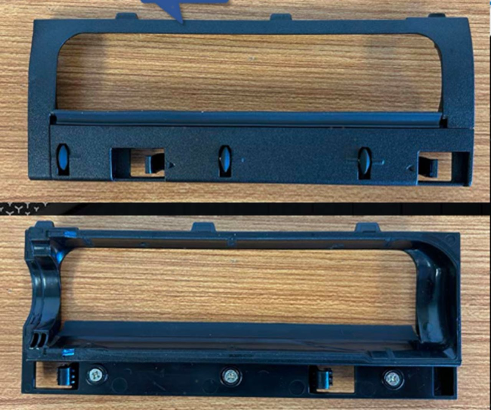
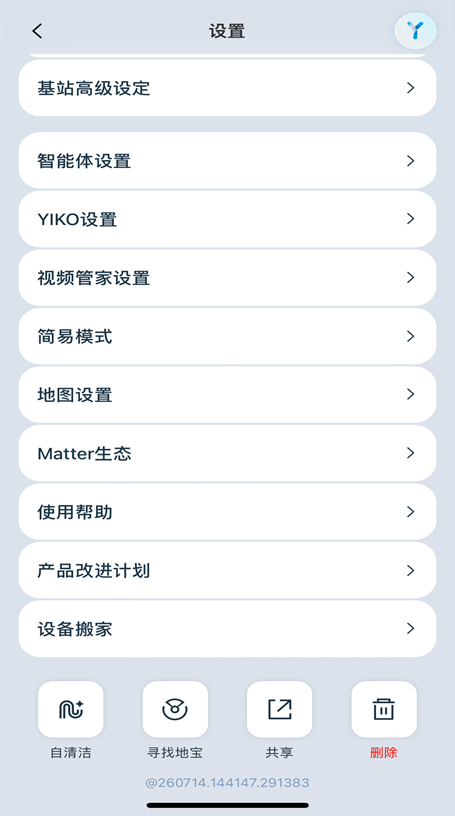
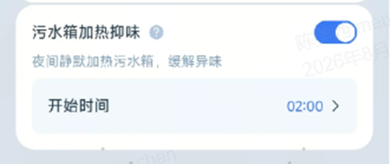
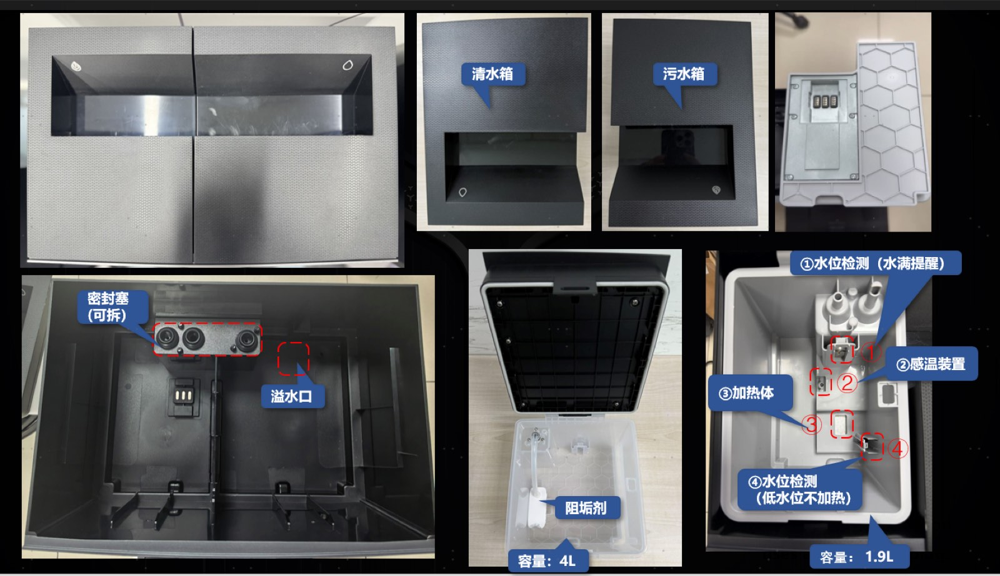
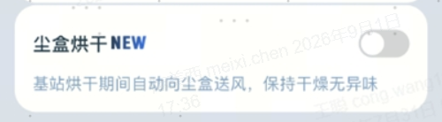
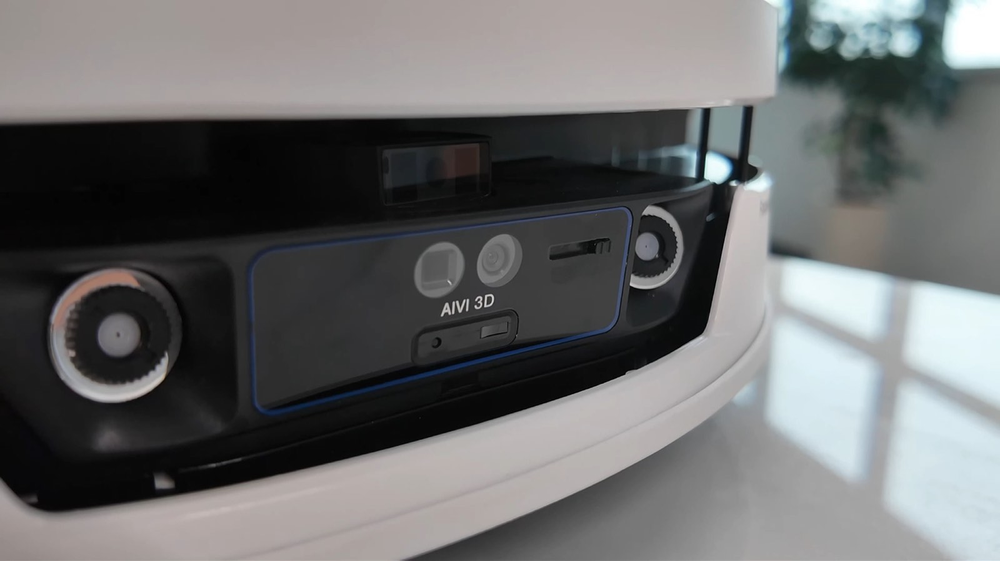

# X12S Series (Planck S Plus) — New Features Deep Dive

> Source: 知识点分享群 · Hoi · 2026-09-02

**机型 Models：** X12S PRO (TW)、X12S OmniCyclone、X12S PRO OMNI、X12S PRO with Auto Refill And Drain (TW&KR)

**主要功能 Key features：** 灵渍深洁、灵缠 4.0、灵隙 3.0、AGENT YIKO 3.0、基站增压活水净洗、污水箱加热抑菌（新）、巨浪（新）、真空除螨腔（新）、尘盒烘干（新）

## 1. 吸力概念变更 Pa → AW Suction unit change

Air-Watt（空气瓦特）是吸尘器的**有效吸入功率**单位，表达**风量 (L/s)** 和**真空吸力 (Pa)** 的综合效率，是吸尘器行业公认的衡量吸尘能力的最准确指标。

Air-Watt is the unit of **effective suction power**, expressing the combined efficiency of **airflow (L/s)** and **vacuum suction (Pa)**. It is the industry-recognized, most accurate measure of vacuuming capability.

## 2. 瞬时超充 Plus Instant Flash Charging Plus (cannot be disabled 不可关闭)

**① 标准补电逻辑 Standard top-up logic：** 约剩余 15%–89% 电量会触发瞬时超充任务，机器每次执行回洗抹布任务时正常触发超充。若机器电量低于 40% 且不足以完成本次清扫任务时，底层将补电模式自动转换为自适应模式，出现纯补电任务，每 15 分钟回去补电一次，每次默认执行 5 分钟补电，其它不变（如非纯补电任务，还按照标准档位执行）。注：仅扫地模式（高频集尘）下不触发超充，除非触发自适应超充。
- Triggered between 15%–89% battery during mop-wash returns. Below 40% battery when the task cannot be completed, the firmware auto-switches to adaptive mode: pure top-up tasks every 15 minutes, 5 minutes each. Sweeping-only mode (high-frequency dust emptying) does NOT trigger flash charging unless adaptive charging kicks in.

**② 自适应补电逻辑 Adaptive top-up logic：** 扫拖模式下机器人根据设定的回洗抹布间隔自动规划返回基站补电。10 分钟回洗间隔：工作约 10 分钟后返回洗抹布同时超充；15 分钟间隔：约 15 分钟后回洗+超充；**25 分钟间隔：为保障续航，最长工作约 15 分钟后即返回进行超充（只超充不回洗）**。
- In sweep+mop mode the robot returns per the configured mop-wash interval. With the 25-min interval, to protect battery life it returns for charging only after at most ~15 minutes of work.

**③ 超充散热逻辑 Cooling logic：** 散热由机器内置温度感应器判断执行，每次散热时间为 25min；清扫任务结束后主机会提前结束散热任务。
- Cooling is triggered by the internal temperature sensor, 25 minutes per cycle, ended early when the cleaning task finishes.

## 3. 真空除螨腔 Vacuum Dust-Mite Chamber (with mite-removal report 有除螨报告)

把原主刷盖板上的三处贴地毛毡改为**超薄橡胶导轮**，帮助滚刷腔体下压的同时在地面滚动前行，深入地毯，减小滚刷与地毯间的缝隙，提升吸尘性能。
- The three felt pads on the main-brush cover are replaced by **ultra-thin rubber guide wheels** that press the brush chamber down while rolling, reaching deep into carpet and reducing the gap between roller and carpet for better suction.

注意 Notes：导轮易缠绕毛发，清洁导轮需要拆下主刷盖背面三颗螺丝；前期导轮备件在地毯上可能出现异音，后续备件更新升级会改善 — The wheels tangle with hair easily; cleaning requires removing three screws on the back of the brush cover. Early spare wheels may squeak on carpet; an updated spare part will fix this.

## 4. 原生越障 2.5cm Native 2.5cm obstacle crossing

取消辅助轮设计，改用 7.6cm 超大直径驱动轮，实现原生越障 2.5cm、连续越障 4.9cm。
- Auxiliary wheels are removed in favor of 7.6cm oversized drive wheels: 2.5 cm native crossing, 4.9 cm continuous crossing.

## 5. 巨浪 "Big Wave" station self-clean

替代原本的基站自清洁功能，高压喷水冲洗清洁槽接水托盘。
- Replaces the old station self-clean: high-pressure water jets flush the cleaning-tray water pan.

1. 巨浪会在**末次**清洗完拖布后自动触发 — Auto-triggers after the FINAL mop wash.
2. 手动点击 APP 自清洁按钮可手动触发 — Or trigger manually via the app's self-clean button.
3. 巨浪触发需要机器在基站内待机，不涉及出基站 — Requires the robot to be docked and idle; the robot never leaves the station.

## 6. 污水箱加热 Dirty-water-tank heating

污水箱按设定时间开始加热，抑制异味滋生。采用 Gore-Tex 防水透气膜阻隔异味扩散。
- The dirty-water tank heats at the scheduled time to suppress odor, with a Gore-Tex breathable membrane blocking odor diffusion.

1. 加热温度 70°C，不会煮沸污水 — Heats to 70°C, never boils.
2. 70°C 加热持续 20 分钟 — The 70°C phase lasts 20 minutes.
3. 从室温加热到 70°C 大约需要 2-3 小时 — Room temperature to 70°C takes ~2–3 hours.
4. 触发需主机满电待机；**工作中 & 电量不足会导致加热不触发** — Requires the robot fully charged and idle; working or low battery prevents heating.

## 7. 尘盒烘干 Dust-bin drying

基于 BLAST 技术的静音送风能力，基站内自动烘干时同步烘干尘盒在内的吸尘风道，使灰尘干燥蓬松、减少异味。
- Using BLAST quiet-air technology, station drying also dries the dust bin and suction duct so dust stays dry and fluffy with less odor. **与基站烘干任务同时触发，持续 40min，噪音比普通烘干大，约 45-50 分贝** — Runs together with station drying for 40 minutes, louder than normal drying at ~45–50 dB.

## 附图 Screenshots

## 区域特性 Regional differences

- **仅 AMR & KR 配备隐私挡片**，可物理遮挡摄像头 — Privacy shutter (physical camera cover) only on AMR & KR units.
- **海外仅 AMR 不配备污水箱加热抑菌功能**，外观与原 X12 Series 清污水箱相同 — Overseas, only AMR lacks dirty-water-tank heating;外观与原 X12 系列水箱相同 (same appearance as the original X12 Series tanks).
