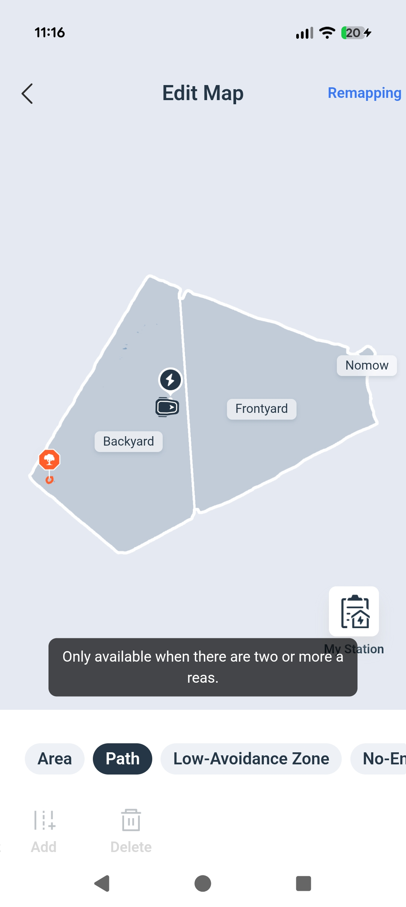

# GOAT Mower — Path Creation Requires Two Separate Zones

> Source: 知识点分享群 · Hoi · 2026-09-17

割草机无法添加通道/Path —— 仅在有两块区域时才能创建 Path；另外再创建区域时，两个区域之间需要有间隔。

The GOAT mower cannot add a channel/Path: a Path can only be created when there are exactly TWO zones. Also, when creating additional zones, there must be a gap between the two zones.

