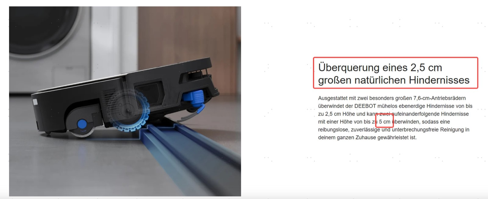

# X12S Obstacle Crossing Claims — 50mm and 49mm Clarifications

> Source: 知识点分享群 · Hoi · 2026-09-17 & 2026-08-26

**Q: X12S 可以越障 50mm？ Can the X12S cross obstacles of 50mm?**

答：50mm 指的是机器可连续越障的高度，科沃斯地宝 X12S 系列产品可连续翻越两级 25mm 衔接台阶。该数据为实验室测试条件下的最大越障高度，具体以家庭实际使用为准。

A: 50mm refers to the maximum continuous obstacle-crossing height of the robot. The ECOVACS DEEBOT X12S series can continuously climb two connected 25mm steps. This figure is the maximum obstacle-crossing height obtained under laboratory test conditions. Actual performance may vary based on home environments.

- 实验室测试条件 Laboratory test conditions：第一层台阶高度 ≤25mm、宽度 ≥20cm；第二层台阶高度 ≤25mm — First step height ≤25 mm, width ≥20 cm; second step height ≤25 mm.

**Q: X12S 能越障 49mm？ Can the X12S cross obstacles of 49mm?**

至高越障 49mm 指科沃斯地宝 X12S 家族在第一层高度 ≤25mm、第二层高度 ≤24mm 时，最高实现双层 49mm 的越障。数据来源科沃斯实验室，具体以家庭实际使用为准。

"Up to 49mm" refers to the DEEBOT X12S family crossing a double-layer obstacle at most 49mm high when the first layer is ≤25mm and the second layer is ≤24mm. Data from the ECOVACS lab; actual performance may vary in home environments.
