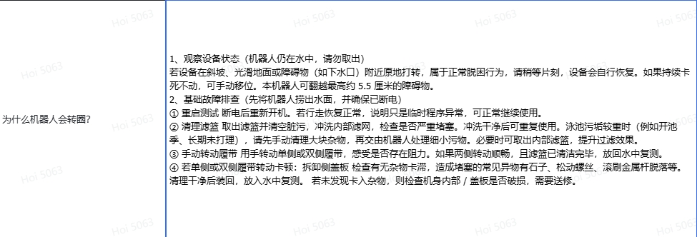
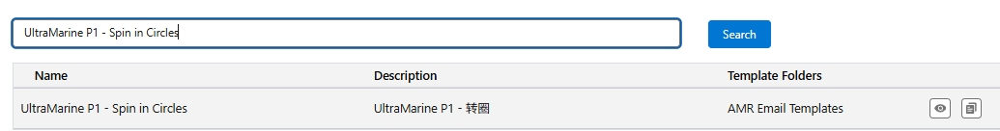

# UltraMarine P1 — Why Does the Robot Spin in Circles? (8 Causes)

> Source: 知识点分享群 · Hoi · 2026-09-19 (updated)

泳池机 UltraMarine P1 原地转圈的 8 种原因与处理措施。根据用户描述的现象针对性回复：

**1. Boss 底柱与底壳连接处断裂 — Boss column cracked loose from the bottom shell**
- 现象：原地转圈；蓝灯常亮；捞出后发现机器外观破损 — Spins in place; blue LED stays on; visible damage after lifting the robot out.
- 措施：引导换机 — Guide the customer to a unit replacement.

**2. 电机螺丝断裂 — Motor screw broken**
- 现象：原地转圈；引导用户拆开侧挡板，可以看到螺丝断裂 — Spins in place; a broken screw is visible after removing the side cover.
- 措施：引导换机 — Unit replacement.

**3. 程序崩溃 — Software crash**
- 现象：原地转圈或不规则移动；外观无损坏；捞出后无故障报警；驱动轮正常转动、履带内无脏污 — Spins or moves irregularly; no exterior damage; no alarm after removal; tracks turn normally and are clean.
- 措施：引导用户重启 — Guide the user to restart the robot.

**4. 单侧保险丝烧毁 — One-side fuse blown**
- 现象：机器朝一个方向原地转圈；捞出后 APP 有驱动轮卡住告警；履带内无脏污 — Spins toward one direction; "drive wheel stuck" alarm in the app after removal; tracks clean.
- 措施：密封舱进水导致保险丝烧毁，引导用户换机 — Water ingress in the sealed compartment blew the fuse; unit replacement.

**5. 滤篮堵塞 — Filter basket clogged**
- 现象：原地转圈或不规则挪移；重污/开荒环境清洁后；滤篮被可见堵住、可存大量水；捞出后无故障报警；驱动轮正常、内无污渍 — Spins or shuffles; after cleaning heavy dirt / pool-opening sludge; visibly clogged basket that holds a lot of water; no alarm; tracks normal and clean.
- 措施：泳池污渍超过滤篮承受能力导致堵塞，及时捞出并清洗滤篮即可。若泳池脏污较多，建议及时捞出清洗滤篮；清洁重污场景时建议取出内滤篮以获得最佳过滤性能。开池季或长期未清理的泳池，先人工清理大块杂物（泥沙、落叶、药粉残留），再由机器人完成精细维护 — The pool's dirt exceeded the basket's capacity. Lift the robot out and rinse the basket promptly. For heavy dirt, remove the inner basket for best filtration; in pool-opening season, hand-remove large debris first.

**6. 斜坡 + 光滑材质/污渍打滑 — Slope + slippery surface or slick grime**
- 现象：约 25° 斜坡且材质较滑或有污渍，可能导致打滑转圈 — On ~25° slopes with slippery surfaces or grime the robot may slip and spin.
- 话术：机器在坡度较大且较光滑的材质上行走时会短暂打滑，原地旋转是机器在尝试继续行走和清洁泳池，稍作等待会继续清洁；若持续原地打转无法继续运行，需要手动挪移脱困 — The robot may briefly slip on steeper, slicker surfaces; spinning means it is still trying to clean. If it keeps spinning, move it manually to free it.

**7. 越障脱困 — Obstacle crossing / self-recovery**
- 现象：机器卡在障碍物（如地漏）上时，可能原地转圈或反复挪移 — When caught on obstacles (e.g. drains) the robot may spin or shuffle repeatedly.
- 话术：机器在障碍物上打转是在尝试脱困，完成后会继续清洁；若持续打转无法运行，需手动挪移脱困（越障能力约 5.5cm）— Spinning on an obstacle means it is trying to free itself and will resume cleaning; if it cannot recover, move it manually (max obstacle ~5.5 cm).

**8. 单侧驱动轮卡住 — One drive track jammed**
- 现象：水系正常、灯效正常；捞出后有驱动轮报警；履带内有异物卡住 — Water and LEDs normal; drive-wheel alarm after removal; debris inside the track.
- 措施：若卡顿一侧履带转动吃力或完全无法转动，检查履带内异物（拆卸侧板方法详见说明书）。常见异物：石子、松动螺丝、滚刷金属杆脱落 — If one track is stiff or locked, check for debris inside (side-cover removal per the manual). Common items: stones, loose screws, detached roller-brush metal rods.

---

**English FAQ summary (official):**

**Check Robot Status (Leave robot in water. Do NOT take it out):** If the robot spins near slopes, smooth surfaces or drains, it is trying to free itself. Wait a moment for auto recovery. If it stays stuck, move it manually. The robot can climb obstacles up to ~5.5 cm.

**Basic Troubleshooting (Take robot out of water and power it off first):**
1. **Restart** — Power off then restart. If it moves normally, the issue was a temporary software error.
2. **Clean Filter Basket** — Take out and empty the filter basket. Rinse the inner filter and check for heavy blockage. For very dirty pools, remove big debris by hand first, then let the robot clean fine dirt; remove the inner basket if needed for better filtration.
3. **Turn Tracks Manually** — Rotate one or both tracks by hand to feel for resistance. If tracks turn smoothly and the basket is clean, put the robot back in water to test.
4. **Stiff tracks on one or both sides** — Remove the side cover and check for trapped debris (stones, loose screws, fallen roller-brush metal rods). Clean, refit and retest in water. If no debris is found, check internal parts/cover for damage — the robot needs warranty service.

Email templates: search "UltraMarine P1 - Spin in Circles" / "UltraMarine P1 - 转圈" in the template sheet.

## 附图 Screenshots (现象判断表 Symptom-judgement table)

